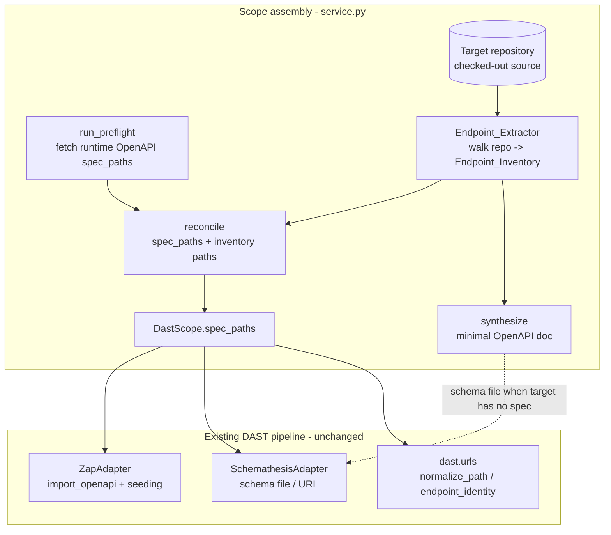
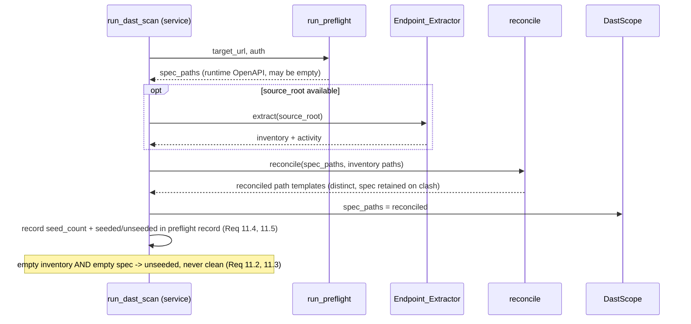

# Design Document

## Overview

The DAST service scans a *running* target. Its scanners are only as good as the list
of endpoints they are handed: ZAP attacks only URLs already on its site tree, and
Schemathesis generates requests only for operations declared in an OpenAPI schema.
Today both are seeded from one source — the OpenAPI spec fetched from the running
target at preflight (`dast/preflight.py` `_fetch_spec_paths`). A target that publishes
no spec, or an incomplete one, hands the scanners an empty map, and the run reports a
false all-clear.

Endpoint extraction closes that gap by reading endpoints out of the target
repository's **source code** rather than trusting the running app to describe itself.
A new `Endpoint_Extractor` walks the checked-out repository, recognises route
declarations across several languages through pluggable `Language_Extractor`s, and
produces a normalised, deduplicated `Endpoint_Inventory`. That inventory is then:

1. **reconciled** with any runtime OpenAPI spec into a single set of path templates,
2. used to **seed** the scanners through `DastScope.spec_paths` (no adapter changes),
3. **synthesised** into a minimal OpenAPI document Schemathesis can consume when the
   target publishes none, and
4. reported as **extraction evidence** that feeds the existing Phase 2 trust model, so
   an empty inventory surfaces as an *unseeded* scan surface, never as clean.

### What this feature is (and is not)

Simply put: we read code to find the app's routes, normalise them the same way the
scanners normalise live URLs, and hand that list to the existing pipeline.

- **Static only.** The extractor *reads files*. It never executes, imports, evaluates,
  or invokes any code from the target repository (Req 1.5–1.8). Python routes are read
  with the standard-library `ast` parser (which builds a syntax tree without running
  the module); other languages are read with line/token scanning. There is no runtime
  boot, no framework loading, no LLM.
- **Reuses the existing architecture.** It reuses `DastScope`, the `spec_paths`
  contract already consumed by the ZAP and Schemathesis adapters, the `dast.urls`
  normalisation (`normalize_path` / `endpoint_identity` and the shared `{id}`
  placeholder), the `DAST_`-prefixed configuration convention, and the Phase 2
  liveness/trust model (`ToolActivity`/coverage semantics, "no false clean").
- **Paths and methods, plus path parameters.** The inventory carries each endpoint's
  HTTP method, a normalised path template, and its parameters. Full request-body
  schemas remain a real OpenAPI document's job for Schemathesis; the synthesised schema
  is minimal and this limitation is stated on purpose.

### Key design decisions

1. **In-service component, not a standalone tool.** The `Endpoint_Extractor` is a pure
   Python component under a new `dast/endpoints/` package, invoked by the DAST service
   during scope assembly. This mirrors how preflight already produces `spec_paths` and
   keeps the scanners unchanged.
2. **Pluggable `Language_Extractor`s behind one protocol.** Each registered extractor
   recognises route declarations for exactly one language/framework (Req 2.1). Adding a
   language means registering one more extractor — no existing extractor changes
   (Req 2.5), exactly as `DastAdapter`s are duck-typed and registered in the runner.
3. **Normalise through the shared placeholder.** Extracted paths are templatised to the
   shared `dast.urls.PLACEHOLDER` (`{id}`) so an extracted endpoint and a scanned URL
   collapse to one identity (Req 4). The normaliser is a fixed point of
   `endpoint_identity` (Req 4.6), which is the property that guarantees we reuse the
   scanner's own identity language rather than inventing a divergent second one.
4. **Deterministic everywhere.** Extraction, dedup, reconciliation, and synthesis are
   pure and order-independent, producing identical inventories and byte-identical
   schemas across runs (Req 1.9, 5.3, 8.6). This is what lets a finding be re-confirmed
   and a diff be trusted.
5. **Trust integration over silence.** An empty inventory combined with an empty spec is
   recorded as an *unseeded* scan surface distinct from scanned-and-clean (Req 11.2,
   11.3), reusing the same honesty model the ZAP/Schemathesis adapters already feed.

## Architecture

### Where extraction sits in the existing flow

The new work is on the *left* of scope assembly. Everything from `DastScope.spec_paths`
rightward already exists and is reused unchanged.



### Inside the extractor

```mermaid
flowchart TD
    START[extract repo_root] --> ROOTCHK{root exists\nand is a directory?}
    ROOTCHK -->|no| ERR[raise ExtractionError\nno inventory - Req 10.2]
    ROOTCHK -->|yes| WALK[bounded traversal\nskip excluded dirs subtrees\nskip oversized files - Req 9]
    WALK --> CONF{resolved path\ninside root? - Req 1.3}
    CONF -->|no| SKIP1[skip file - Req 1.4]
    CONF -->|yes| DISPATCH[dispatch to matching\nLanguage_Extractors - Req 2]
    DISPATCH -->|no match| SKIP2[skip file - Req 2.3]
    DISPATCH -->|1+ match| READ[read + statically parse\nno exec/import/eval - Req 1.5-1.8]
    READ -->|read/parse fails| SKIP3[skip file, continue - Req 10.1]
    READ --> RAW[RawRoutes: method(s), raw_path, line]
    RAW --> NORM[normalise path -> template + params - Req 3,4]
    NORM --> ENDP[ExtractedEndpoints\nfilter to supported methods - Req 3.5]
    SKIP1 --> COLLECT
    SKIP2 --> COLLECT
    SKIP3 --> COLLECT
    ENDP --> COLLECT[collect all endpoints]
    COLLECT --> DEDUP[deterministic dedup - Req 5]
    DEDUP --> INV[Endpoint_Inventory + Extraction_Activity - Req 11.1]
```

### How reconciliation and seeding flow at the service seam



The critical property visible here: the reconciled templates become `DastScope.spec_paths`
*verbatim*, so the ZAP and Schemathesis adapters seed their scan surface with no change
to those adapters (Req 7). When the target publishes no spec, the synthesised OpenAPI
document is written to a file the Schemathesis adapter already knows how to load
(`DAST_SCHEMATHESIS_SCHEMA_FILE`), and the same reconciled templates seed ZAP.

## Components and Interfaces

The extractor lives in a new `dast/endpoints/` package (sibling to `dast/adapters/`),
reusing `dast.urls` for placeholder shape and integrating with `dast.preflight` /
`dast.service` / `dast.models` at the seam. Interfaces are shown in Python; the
target-framework snippets are examples of what is *parsed* (never executed).

### Component 1: `LanguageExtractor` protocol (the extension point)

The common contract every language/framework extractor implements. Adding a language
means adding one plugin and registering it — no existing extractor is touched (Req 2.5).
Duck-typed against a Protocol, mirroring how `DastAdapter` works.

```python
@runtime_checkable
class LanguageExtractor(Protocol):
    """Recognises Route_Declarations for exactly one language/framework (Req 2.1)."""

    #: Stable language/framework label, recorded in Extraction_Activity.languages.
    #: e.g. "python", "javascript", "go", "ruby".
    language: str

    def matches(self, source_path: str) -> bool:
        """True when this extractor handles the file (by extension/filename only).

        Cheap and static — never reads or parses the file. A file may match more
        than one extractor; the engine applies all matches (Req 2.4).
        """

    def discover(self, source_text: str, *, source_path: str) -> list["RawRoute"]:
        """Return the Route_Declarations found in already-read source text.

        Pure and side-effect free. MUST NOT execute, import, evaluate, or invoke
        the source (Req 1.5-1.8): the Python extractor uses ``ast.parse`` (builds a
        tree without running the module); the others scan lines/tokens with regexes.
        Raising is allowed — the engine catches it and skips the file (Req 10.1).
        """
```

**v1 registered extractors** (one language/framework each):

| `language` | Recognises (examples) | Static technique |
| --- | --- | --- |
| `python` | Flask/FastAPI `@app.route("/u/<id>")`, `@app.get("/u/{id}")`, `@router.post(...)` | `ast.parse` → walk decorators |
| `javascript` | Express `app.get("/u/:id", ...)`, `router.post(...)`, `app.use("/mount", r)` | line/token regex scan |
| `go` | `net/http` `http.HandleFunc("/u", ...)`, `mux.HandleFunc(...)` | line/token regex scan |
| `ruby` | Sinatra `get "/u/:id" do`, Rails `get "/u/:id" => ...` | line/token regex scan |

Registration is a simple list, resolved once (analogous to `default_adapters`):

```python
def default_language_extractors() -> list[LanguageExtractor]:
    return [PythonExtractor(), JavaScriptExtractor(), GoExtractor(), RubyExtractor()]
```

### Component 2: `RawRoute` (extractor output, pre-normalisation)

```python
@dataclass(frozen=True)
class RawRoute:
    #: HTTP verbs registered by this declaration, framework-native case. Empty means
    #: "no explicit method" -> the engine defaults it to GET (Req 3.3).
    methods: tuple[str, ...]
    #: Framework-native path, e.g. "/users/:id", "/users/<int:id>", "/users/{id}".
    raw_path: str
    #: 1-based line where the Route_Declaration begins (Req 3.1).
    line: int
    #: Optional query-parameter names the extractor could read (path params are
    #: derived from the path during normalisation, Req 3.4).
    query_parameters: tuple[str, ...] = ()
```

### Component 3: path normalisation (`dast/endpoints/normalize.py`)

Turns a framework-native path into the shared canonical template **and** extracts the
declared dynamic-segment names, reusing `dast.urls.PLACEHOLDER` so the manifest speaks
the scanner's identity language.

```python
def normalize_route_path(raw_path: str) -> tuple[str, tuple[str, ...]]:
    """Return (path_template, ordered path-parameter names).

    - Every dynamic segment -> the shared {id} placeholder (Req 4.1, 4.2), covering
      the :name colon form, the <name> and <type:name> angle forms, the {name} brace
      form, and a bare * wildcard segment.
    - Exactly one leading '/', no scheme/host (Req 4.3).
    - Runs of '//' collapsed to '/' (Req 4.4).
    - Trailing '/' removed except for the root '/' (Req 4.5).
    The returned names are the segment names as declared (before {id} collapsing),
    each becoming a path-kind Endpoint_Parameter (Req 3.4).
    """
```

Design note: normalisation is deliberately a *separate* pure function from
`dast.urls.normalize_path`. `dast.urls.normalize_path` templatises a *concrete URL*
(guessing which segments are ids); `normalize_route_path` templatises a *declared route*
(the names are known). The two must agree on the output shape — Req 4.6 pins that: the
template we emit is a fixed point of `endpoint_identity`.

### Component 4: `EndpointExtractor` (orchestrator)

**Purpose**: walk the repository under the safety and traversal bounds, dispatch each
file to the matching `Language_Extractor`s, normalise and filter routes, dedupe, and
return the inventory plus its activity record.

```python
class EndpointExtractor:
    def __init__(
        self,
        extractors: Sequence[LanguageExtractor] | None = None,
        *,
        settings: DastSettings = dast_settings,
    ) -> None: ...

    def extract(self, repo_root: str) -> "ExtractionResult":
        """Walk ``repo_root`` and return one Endpoint_Inventory + Extraction_Activity.

        Raises ExtractionError only when ``repo_root`` does not exist or is not a
        directory (Req 10.2). Every other failure (unreadable/unparseable file, file
        outside root, oversized file, unmatched language) degrades to skipping that
        file and continuing (Req 1.4, 2.3, 9.7, 10.1). Performs no network I/O
        (Req 1.2). Deterministic: two runs over an unchanged repo return inventories
        with an identical set of endpoints (Req 1.9).
        """
```

Orchestration sequence (pure except for reading files):

1. **Root check (Req 10.2):** resolve `repo_root`; if it does not exist or is not a
   directory, raise `ExtractionError` naming the path. No inventory is returned.
2. **Bounded traversal (Req 9):** walk the tree; for each directory whose
   repo-relative path matches an `Exclusion_Pattern`, prune the entire subtree without
   descending (Req 9.3, 9.4). This uses `os.walk` with in-place `dirnames[:]` pruning.
3. **Path confinement (Req 1.3, 1.4):** resolve each candidate file's absolute path
   (following symlinks and `..`); if it falls outside the resolved root, skip it and
   continue.
4. **Size bound (Req 9.7):** `os.path.getsize` before reading; if strictly greater than
   the configured maximum, skip without reading contents.
5. **Dispatch (Req 2.2–2.4):** collect every extractor whose `matches()` is true; if
   none match, skip the file with no error (Req 2.3); otherwise read the file once and
   pass its text to each matching extractor, combining their `RawRoute`s.
6. **Read/parse resilience (Req 10.1):** any `OSError`/`UnicodeDecodeError` on read, or
   any exception raised by an extractor's `discover()`, is caught; the file is skipped
   and traversal continues.
7. **Route → endpoints (Req 3):** for each `RawRoute`, normalise the path, derive path
   parameters, expand to one `ExtractedEndpoint` per method (defaulting to `GET` when
   none, Req 3.3), and drop any method outside `{GET, POST, PUT, PATCH, DELETE}`
   (Req 3.5). The endpoint records its repo-relative source file and 1-based line
   (Req 3.1).
8. **Dedup (Req 5):** collapse endpoints sharing an `Endpoint_Identity` via the
   deterministic rule below.
9. **Activity (Req 11.1):** count files actually read by an extractor, count endpoints
   in the resulting inventory, and collect the set of languages whose extractor
   produced at least one route.

### Component 5: deterministic dedup (`dast/endpoints/dedup.py`)

```python
def deduplicate(endpoints: Iterable[ExtractedEndpoint]) -> tuple[ExtractedEndpoint, ...]:
    """Collapse endpoints sharing an Endpoint_Identity (method, path_template).

    For each identity group (Req 5):
      - retained source location = the minimum by (repo-relative path, line) so the
        choice is independent of discovery/traversal order (Req 5.1, 5.3);
      - parameters = the union keyed by name across the group, each name once
        (Req 5.2);
      - output is sorted by (path_template, method) so the inventory itself is a
        deterministic sequence.
    """
```

### Component 6: reconciliation (`dast/endpoints/reconcile.py`)

```python
def reconcile(spec_paths: Sequence[str], inventory_paths: Sequence[str]) -> tuple[str, ...]:
    """Union runtime-spec templates with inventory templates (Req 6).

    - Distinct templates each appear exactly once (Req 6.1).
    - Two templates that denote the same identity keep the OpenAPI_Spec template and
      drop the inventory one (Req 6.2); identity is computed by canonicalising every
      brace segment {..} to the shared {id} (so /u/{user_id} and /u/{id} match).
    - Empty spec -> inventory alone; empty inventory -> spec alone; both empty ->
      empty (Req 6.3, 6.4, 6.5).
    Order: spec templates first (in their given order), then inventory-only templates.
    """
```

Design note on identity across placeholder names: OpenAPI templates name their
parameters (`/users/{user_id}`) while the inventory always uses the shared `{id}`.
Reconciliation canonicalises any `{...}` segment to `{id}` purely to *compare* two
templates; the retained template's original text is preserved (the spec's name when a
clash occurs — Req 6.2). This keeps `spec_paths` in the exact normalised `dast.urls`
form the adapters already consume (Req 7.3).

### Component 7: schema synthesis (`dast/endpoints/synthesize.py`)

```python
def synthesize_openapi(inventory: EndpointInventory) -> dict: ...
def synthesize_openapi_bytes(inventory: EndpointInventory) -> bytes: ...
def parse_openapi(document: Mapping | dict) -> EndpointInventory: ...
```

- `synthesize_openapi` emits a minimal OpenAPI 3.0 dict: one `paths` entry per distinct
  template, one operation per method under it (Req 8.1). Each `{id}` segment declares a
  required `path` parameter of type `string` (Req 8.5); query parameters are optional
  `string` query params. No `requestBody`, no response schemas (stated limitation).
- An empty inventory yields a structurally valid document with an empty `paths`
  object (Req 8.4).
- `synthesize_openapi_bytes` serialises with sorted keys and a fixed separator so two
  invocations over the same inventory produce **byte-identical** output (Req 8.6).
- `parse_openapi` reads an OpenAPI document back into an `EndpointInventory` (identities
  only), enabling the synthesise→parse round-trip (Req 8.3). Only methods in the
  supported set are read, mirroring extraction.

### Component 8: service-seam wiring (the only change to existing code)

Additive, mirroring how the ZAP design added a spec source. The extractor and
reconciliation are invoked in `dast/service.py` during scope assembly; nothing in the
adapters changes.

```python
# dast/models.py — ScanRequest gains the repo root to extract from (optional)
class ScanRequest(BaseModel):
    target_url: str
    commit_sha: str = ""
    profile: str = "fast"
    kind: str = "deploy"
    source_root: Optional[str] = None   # NEW: checked-out repo to extract endpoints from

# dast/service.py — assemble scope with reconciled spec_paths
def _assemble_scope(record, preflight) -> DastScope:
    inventory, activity = (EndpointExtractor().extract(record.source_root)
                           if record.source_root else (EMPTY_INVENTORY, EMPTY_ACTIVITY))
    reconciled = reconcile(preflight.spec_paths, [e.path for e in inventory.endpoints])
    # Record seed evidence in the scan's preflight record (Req 11.4, 11.5, 11.2, 11.3).
    record.preflight["extraction"] = activity_to_dict(activity)
    record.preflight["spec_seed"] = {
        "seed_count": len(reconciled),
        "seeded": bool(reconciled),
    }
    return DastScope(
        target_url=record.target_url,
        commit_sha=record.commit_sha,
        auth_header=dast_settings.DAST_AUTH_HEADER,
        spec_paths=reconciled,                # Req 7.1-7.4
        profile=record.profile,
    )
```

When `preflight.spec_paths` is empty, the service also writes `synthesize_openapi_bytes`
to a temp file and points `DAST_SCHEMATHESIS_SCHEMA_FILE` at it, so Schemathesis runs
against the synthesised schema (Req 8) while ZAP seeds from the same `spec_paths`.

## Data Models

The design reuses `DastScope`, `ToolActivity`, `ToolCoverage`, and `Finding` unchanged.
It adds extraction-specific models under `dast/endpoints/models.py`, all frozen
dataclasses so the pure core stays hashable and side-effect free (matching the existing
`dast/models.py` and `app/security/models.py` style).

```python
class ParameterKind(Enum):
    PATH = "path"
    QUERY = "query"

@dataclass(frozen=True)
class EndpointParameter:
    name: str
    kind: ParameterKind

@dataclass(frozen=True)
class ExtractedEndpoint:
    """One normalised endpoint (Req 3.1)."""
    method: str                              # upper, in {GET,POST,PUT,PATCH,DELETE}
    path: str                                # normalised template, e.g. "/users/{id}"
    parameters: frozenset[EndpointParameter] # set; identity-independent metadata
    source_file: str                         # repo-relative path
    source_line: int                         # 1-based

    @property
    def identity(self) -> tuple[str, str]:
        """Endpoint_Identity = (HTTP_Method, Path_Template) (Req 5, matches dast.urls)."""
        return (self.method, self.path)

@dataclass(frozen=True)
class EndpointInventory:
    """Deduplicated collection produced by one extraction run (Req 1.1)."""
    endpoints: tuple[ExtractedEndpoint, ...]   # sorted by (path, method) for determinism

@dataclass(frozen=True)
class ExtractionActivity:
    """Evidence of one extraction run (Req 11.1) — the extraction analogue of ToolActivity."""
    files_read: int                 # Source_Files a Language_Extractor actually read
    endpoints_found: int            # endpoints in the resulting inventory
    languages: frozenset[str]       # languages whose extractor produced >= 1 route

@dataclass(frozen=True)
class ExtractionResult:
    """What one extraction run produced: the single inventory + its evidence."""
    inventory: EndpointInventory
    activity: ExtractionActivity
```

**Invariants (enforced by construction):**
- `method` ∈ {GET, POST, PUT, PATCH, DELETE}; any other verb is dropped (Req 3.5).
- `path` starts with a single `/`, carries no scheme/host, no `//`, no trailing `/`
  except root, and uses only the `{id}` placeholder for dynamic segments (Req 4).
- No two endpoints in an `EndpointInventory` share `(method, path)` (Req 5.1).
- `parameters` never affects `identity`; path params are named after the declared
  dynamic segments (Req 3.4), query params are advisory metadata.

### New configuration (`dast/config.py`, `DAST_`-prefixed)

Every value is read from a `DAST_`-prefixed setting, never a `SECURITY_` one (Req 1.10,
1.11, 9.1, 9.5), consistent with the existing file.

| Setting | Default | Purpose | Requirement |
| --- | --- | --- | --- |
| `DAST_EXTRACT_EXCLUDE_PATTERNS` | `node_modules,vendor,.git,dist,build,__pycache__,.venv,venv,.tox,target` | Comma-separated globs of dirs/files never read | 9.1, 9.2 |
| `DAST_EXTRACT_MAX_FILE_BYTES` | `1048576` (1 MiB) | Max Source_File size; larger files are skipped | 9.5, 9.6, 9.7 |

Both have finite, positive/ non-empty defaults so an absent setting still yields safe,
bounded traversal (Req 9.2, 9.6). The default exclusion set matches dependency and
version-control directories.

### Reused models (unchanged)

- `DastScope.spec_paths` receives the reconciled templates verbatim (Req 7).
- `ScanRecord.preflight` gains an `extraction` block (the `ExtractionActivity`) and a
  `spec_seed` block (`seed_count`, `seeded`) — additive dict keys, no schema change
  (Req 11.4, 11.5).

## Correctness Properties

*A property is a characteristic or behavior that should hold true across all valid
executions of a system — essentially, a formal statement about what the system should
do. Properties serve as the bridge between human-readable specifications and
machine-verifiable correctness guarantees.*

PBT is appropriate here because the core of this feature is a set of
**pure functions over structured data**: path normalisation, endpoint recording,
deterministic dedup, reconciliation, and schema synthesis/parsing. Each has universal
invariants — canonical forms, idempotence, round-trips, order-independence — that must
hold across arbitrary generated inputs. The file-reading traversal is impure but its
safety and bounding rules are still universal invariants, tested over generated
directory trees (temp dirs) rather than a live network. Configuration-naming and
default-value checks are smoke/example tests, not properties (see Testing Strategy).

The properties below were derived from the prework analysis with redundant criteria
consolidated (the five normalisation criteria fold into one canonical-form property;
the three dedup criteria into one; the reconciliation and empty-case criteria into one;
the trust/seed criteria into one).

### Property 1: Extraction is deterministic

*For any* Target_Repository, invoking the Endpoint_Extractor twice over the unchanged
repository with unchanged configuration returns two Endpoint_Inventories that contain
the same set of Endpoint_Identities and, for each shared identity, the same HTTP_Method,
the same Path_Template, and the same set of Endpoint_Parameters.

**Validates: Requirements 1.1, 1.9**

### Property 2: Traversal never reads outside the repository root

*For any* Target_Repository containing files, symbolic links, and relative path
segments whose resolved absolute paths escape the root, no escaping Source_File
contributes an Extracted_Endpoint to the Endpoint_Inventory, and extraction completes
without raising an error.

**Validates: Requirements 1.3, 1.4**

### Property 3: Extraction never executes target code

*For any* Source_File whose contents would produce an observable side effect (creating a
sentinel file, mutating shared state) if executed, imported, or evaluated, running the
Endpoint_Extractor over the repository produces no such side effect.

**Validates: Requirements 1.5, 1.6, 1.7, 1.8**

### Property 4: File dispatch is the union of matching Language_Extractors

*For any* Source_File and any registry of Language_Extractors, the Route_Declarations
discovered for that file equal the union of those discovered by every registered
Language_Extractor whose `matches()` is true for the file; when no registered extractor
matches, the file yields no Route_Declarations and no extraction error is recorded.

**Validates: Requirements 2.2, 2.3, 2.4**

### Property 5: Every discovered route is recorded completely and per supported method

*For any* Route_Declaration, the Endpoint_Extractor records one Extracted_Endpoint per
registered HTTP_Method in the supported set {GET, POST, PUT, PATCH, DELETE}, each
carrying the declaration's Path_Template, its Endpoint_Parameters, and a source location
of the Source_File's repository-relative path with the 1-based line at which the
declaration begins; a declaration with no explicit method yields exactly one endpoint
with method GET; any method outside the supported set is skipped without raising and
without suppressing the supported methods of the same declaration.

**Validates: Requirements 3.1, 3.2, 3.3, 3.5**

### Property 6: Dynamic path segments become named path parameters

*For any* Route_Declaration whose path contains dynamic segments, each dynamic segment
is recorded exactly once as a path-kind Endpoint_Parameter whose name equals the segment
name declared in the Route_Declaration.

**Validates: Requirements 3.4**

### Property 7: Path normalisation produces one idempotent canonical form

*For any* framework-native raw path, the produced Path_Template replaces every dynamic
segment syntax (`:name`, `<name>`, `<type:name>`, `{name}`, and a `*` wildcard) with the
shared `{id}` placeholder while preserving non-dynamic segments, begins with exactly one
leading `/` and carries no scheme or host, collapses every run of two or more `/` into a
single `/`, and removes a trailing `/` for every template other than the root `/`;
normalising an already-normalised Path_Template returns it unchanged (idempotence).

**Validates: Requirements 4.1, 4.2, 4.3, 4.4, 4.5**

### Property 8: A normalised template is a fixed point of the scanner's identity function

*For any* Path_Template produced by the Endpoint_Extractor, passing it to
`dast.urls.endpoint_identity` with no additional Spec_Paths returns that Path_Template
unchanged.

**Validates: Requirements 4.6**

### Property 9: Deduplication is deterministic and order-independent

*For any* collection of Extracted_Endpoints and any permutation of that collection,
deduplication produces the same Endpoint_Inventory: exactly one Extracted_Endpoint per
Endpoint_Identity, whose retained source location is the minimum ordered first by
ascending repository-relative Source_File path and then by ascending line, and whose
Endpoint_Parameters are the union keyed by name of the merged endpoints with each name
appearing once.

**Validates: Requirements 5.1, 5.2, 5.3**

### Property 10: Reconciliation is the identity-distinct union that retains spec templates

*For any* set of OpenAPI_Spec path templates and any set of Endpoint_Inventory
Path_Templates, the reconciled set contains each distinct Endpoint_Identity exactly
once; when an inventory template denotes the same identity as a spec template, the
reconciled set includes the OpenAPI_Spec template and not the inventory one; when the
spec is empty the result is the inventory templates alone, when the inventory is empty
it is the spec templates alone, and when both are empty the result is empty.

**Validates: Requirements 6.1, 6.2, 6.3, 6.4, 6.5**

### Property 11: DastScope.spec_paths equals the reconciled set exactly

*For any* OpenAPI_Spec and Endpoint_Inventory, the assembled `DastScope.spec_paths`
contains exactly the reconciled set of Path_Templates (each present once, none extra),
includes every path template the OpenAPI_Spec alone would have provided, carries each
template in the normalised `dast.urls` form (single leading `/`, no scheme or host), and
is empty with no placeholder or synthesised template added whenever the reconciled set
is empty.

**Validates: Requirements 7.1, 7.2, 7.3, 7.4**

### Property 12: The synthesised schema has one operation per endpoint with `{id}` as a required path parameter

*For any* Endpoint_Inventory, the Synthesized_Schema declares exactly one operation for
each Extracted_Endpoint whose path equals the endpoint's Path_Template and whose verb
equals the endpoint's HTTP_Method, and every `{id}` segment of a template is declared as
a required path parameter of the corresponding operation.

**Validates: Requirements 8.1, 8.5**

### Property 13: The synthesised schema is always loadable

*For any* Endpoint_Inventory, including an empty one, the Synthesized_Schema is a
structurally valid OpenAPI document that Schemathesis loads without raising a
schema-validation error; an empty inventory yields a document declaring zero operations.

**Validates: Requirements 8.2, 8.4**

### Property 14: Synthesise then parse preserves endpoint identities (round-trip)

*For any* Endpoint_Inventory, synthesising a Synthesized_Schema and then parsing that
schema yields an Endpoint_Inventory whose set of Endpoint_Identities equals the original
inventory's set of Endpoint_Identities.

**Validates: Requirements 8.3**

### Property 15: Schema synthesis is byte-deterministic

*For any* Endpoint_Inventory, synthesising a Synthesized_Schema over two separate
invocations produces byte-identical documents.

**Validates: Requirements 8.6**

### Property 16: Traversal is bounded by exclusions and file size

*For any* Target_Repository, no Source_File whose repository-relative path lies within a
directory matching an Exclusion_Pattern (at any depth of that directory's subtree), and
no Source_File whose size in bytes is strictly greater than the configured maximum, is
read or contributes an Extracted_Endpoint to the Endpoint_Inventory.

**Validates: Requirements 9.3, 9.4, 9.7**

### Property 17: One broken file never discards the rest

*For any* Target_Repository mixing readable/parseable Source_Files with unreadable or
unparseable ones, the Endpoint_Inventory contains every Extracted_Endpoint discoverable
from the readable/parseable files, the broken files are skipped, and extraction returns
an Endpoint_Inventory without raising — an inventory that is empty when no route is
discoverable or when every matched Source_File is skipped.

**Validates: Requirements 10.1, 10.3, 10.4**

### Property 18: Extraction activity reports honest counts

*For any* Target_Repository, the Extraction_Activity reports a `files_read` equal to the
number of Source_Files actually read by a Language_Extractor, an `endpoints_found` equal
to the number of Extracted_Endpoints in the resulting Endpoint_Inventory, and a
`languages` set equal to the set of languages whose registered Language_Extractor
produced at least one Route_Declaration.

**Validates: Requirements 11.1**

### Property 19: An unseeded scan surface is never clean

*For any* OpenAPI_Spec and Endpoint_Inventory, the scan surface is marked seeded with a
recorded seed count equal to the number of distinct reconciled Path_Templates when that
reconciled set is non-empty; when the reconciled set is empty (both the spec and the
inventory are empty) the surface is marked with a status distinct from
scanned-and-clean, records a seed count of zero with an unseeded indication, and is
never reported as clean.

**Validates: Requirements 11.2, 11.3, 11.4, 11.5**

## Error Handling

The extractor's default posture is **record-and-degrade, never crash**: one broken file
must never discard the endpoints found in the rest of the repository. The single
exception is a bad repository root, which is a caller error and fails loudly.

- **Repository root missing or not a directory (Req 10.2):** `extract()` resolves the
  root first; if it does not exist or is not a directory it raises `ExtractionError`
  naming the offending path and returns no inventory. This is the only raising path.
- **File resolves outside the root (Req 1.3, 1.4):** the file is skipped and traversal
  continues; it never appears in the inventory. Symlinks and `..` segments are resolved
  before the containment check, so a symlink pointing outside the tree cannot smuggle a
  file in.
- **Excluded directory or file (Req 9.3, 9.4):** matched directories are pruned from the
  walk in place, so their entire subtree is never descended — no file or subdirectory
  within an excluded directory is read.
- **Oversized file (Req 9.7):** size is checked before reading; a file strictly larger
  than `DAST_EXTRACT_MAX_FILE_BYTES` is skipped without its contents being read.
- **Unmatched language (Req 2.3):** a file no registered Language_Extractor matches is
  skipped with no error recorded.
- **Unreadable / unparseable file (Req 10.1):** any `OSError`/`UnicodeDecodeError` on
  read, or any exception raised inside a `Language_Extractor.discover()`, is caught; the
  file is skipped and the run continues. A repo where every matched file is skipped, or
  where no route is discoverable, returns an empty inventory — not an error (Req 10.3,
  10.4).
- **Empty inventory + empty spec at the seam (Req 11.2, 11.3):** the service records the
  scan surface as *unseeded* (seed count zero) — a status distinct from
  scanned-and-clean — so the existing trust model does not let the run render as clean.
  This mirrors how the ZAP adapter treats an unseeded site tree and how
  `_assess_activity` refuses to call an evidence-less run complete.
- **Malformed OpenAPI at parse/round-trip:** `parse_openapi` tolerates a
  missing/empty `paths` object (yielding an empty inventory) and ignores operations
  whose verb is outside the supported set, so a partially-shaped document degrades to
  the identities it can express rather than raising.

There is no path that turns an unseeded or partially-extracted surface into a clean,
complete result: extraction either returns an honest inventory (possibly empty, always
recorded as seeded/unseeded evidence) or, for a bad root only, raises before producing
one.

## Testing Strategy

A dual approach: property-based tests for the pure logic and universal invariants,
example/smoke tests for configuration wiring and specific error conditions.

### Property-based tests

- **Library:** Hypothesis — already used in this repo (see `tests/security/`,
  `tests/security/strategies.py`, and the `.hypothesis` cache). We do not implement PBT
  from scratch.
- **Iterations:** each property test runs a minimum of 100 examples (Hypothesis default
  `max_examples` ≥ 100).
- **Tagging:** each property test carries a comment referencing its design property, in
  the format: `# Feature: dast-endpoint-extraction, Property {number}: {property_text}`.
- **Filesystem over network:** properties that involve traversal (Properties 2, 3, 16,
  17, 18) build generated directory trees under a Hypothesis-managed temp directory —
  including excluded dirs, deep subtrees, oversized files, symlinks escaping the root,
  and side-effecting source snippets — so the invariant is checked over arbitrary inputs
  with no network and no live target.
- **Generators:**
  - raw route paths mixing `:name` / `<name>` / `<type:name>` / `{name}` / `*` segments,
    extra `//`, trailing slashes (Properties 7, 8).
  - route declarations with 0..N methods including unsupported verbs, at known lines
    (Properties 5, 6).
  - `RawRoute` lists with planted duplicates across files/lines, then permuted
    (Property 9).
  - `(spec_paths, inventory_paths)` pairs with deliberate identity clashes and empties
    (Properties 10, 11, 19).
  - `EndpointInventory` values, including the empty inventory (Properties 12–15).
  - directory trees: valid + broken files, excluded dirs, oversized files, escaping
    symlinks (Properties 2, 3, 16, 17, 18).
  - files + registries with controlled `matches()` results (Property 4).

Each of the 19 correctness properties is implemented by a single property-based test.

### Unit tests (example / edge / smoke)

- **Per-language extractor fixtures:** small fixture source files for Python
  (Flask/FastAPI), JavaScript/TypeScript (Express), Go (`net/http`), and Ruby
  (Sinatra/Rails) — reusing/extending `security_samples/multilang/` — asserting the
  exact `(method, path)` set each `Language_Extractor` discovers, including base-path +
  method-path joining. Pure functions over fixture text, no traversal.
- **Registry (Req 2.1, 2.5):** the default registry has one extractor per language;
  adding a new extractor leaves the existing ones unchanged and still functioning.
- **Bad root (Req 10.2):** a missing path and a file-as-root each raise `ExtractionError`
  naming the path; no inventory is returned.
- **No network I/O (Req 1.2):** extraction runs to completion with sockets disabled.
- **Config naming (Req 1.10, 1.11, 9.1, 9.5):** every extractor setting begins with
  `DAST_`; none begins with `SECURITY_` — a smoke assertion over the settings names.
- **Defaults (Req 9.2, 9.6):** with the settings unset, a non-empty default exclusion set
  (dependency + version-control dirs) and a finite positive default max file size are
  applied.
- **Seam wiring (Req 7, 8, 11.4, 11.5):** with a provided `source_root`, the assembled
  `DastScope.spec_paths` equals the reconciled set and the `preflight` record carries the
  `extraction` activity and `spec_seed` blocks; when the target has no spec, a synthesised
  schema file is produced and pointed at by `DAST_SCHEMATHESIS_SCHEMA_FILE`.

### Integration tests (1–3 examples, not run 100×)

- **End-to-end seam:** a small fixture repo → `EndpointExtractor.extract` → `reconcile`
  → `DastScope.spec_paths`, asserting ZAP would seed exactly those paths and Schemathesis
  would load the synthesised schema. Verifies the wiring the pure tests cannot, with a
  couple of representative repos rather than 100 iterations.
