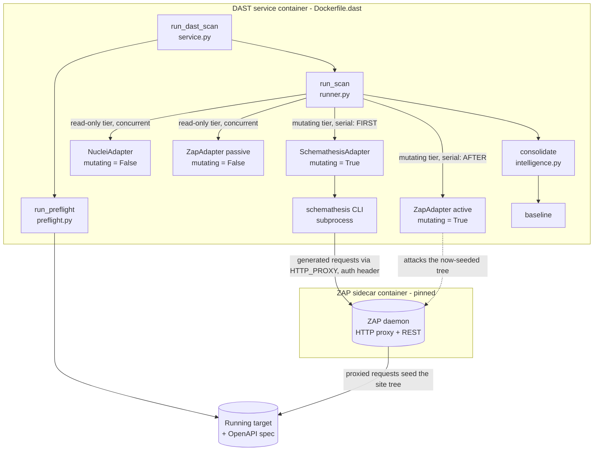
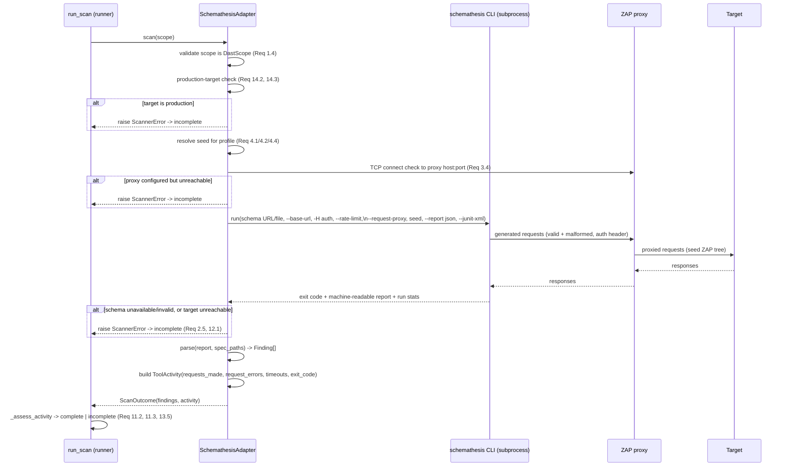

# Design Document

## Overview

Phase 4 adds Schemathesis as a dynamic scanner to the existing standalone DAST
service. Where the `NucleiAdapter` answers "are we exposed to anything already
publicly known?" and the `ZapAdapter` answers "does *our own code* have injection,
XSS, or access-control flaws?", the new `SchemathesisAdapter` answers a third
question: **"does our API behave the way its OpenAPI spec promises?"** It reads the
target's OpenAPI schema, generates thousands of valid and deliberately malformed
requests from it, and checks the responses. An unhandled `5xx` is a security finding,
not just a bug — it means unvalidated input reached our code and usually leaked a
stack trace. Schemathesis also catches operations that answer without authentication
and responses that violate their own declared contract.

This phase carries a second payoff unique to it, and it shapes the design: Schemathesis
is run **through the Phase 3 ZAP sidecar as an HTTP proxy**. One execution yields two
results — Schemathesis reports its own failing cases, and ZAP's site tree fills with
real, authenticated, valid traffic for ZAP's active scanner to work on. The difference
is large: ZAP guessing `id=1` mostly gets 404s, while a Schemathesis request carrying
an ID that actually exists reaches real business logic. So ordering matters —
Schemathesis must run **before** ZAP's active scan in the serial mutating tier, seeding
the map that ZAP then attacks (Req 10.4).

This design reuses the existing architecture rather than reinventing it:

- The `SchemathesisAdapter` implements the existing `DastAdapter` protocol
  (`name`, `mutating`, `scan(scope) -> ScanOutcome`) from `dast/models.py`.
- It mirrors the `NucleiAdapter` structure — **not** the ZAP REST-sidecar structure —
  because Schemathesis is a CLI: an impure `scan()` that drives the Schemathesis CLI
  as a subprocess (via the shared `sast_base.run_scanner`), and a pure `parse()`
  classmethod over Schemathesis's machine-readable output, so parsing is unit-testable
  from a saved fixture with no network.
- It plugs into the existing two-tier `run_scan` runner (`dast/runner.py`). It declares
  `mutating = True` (it sends malformed and state-changing traffic), so the runner
  places it in the serial mutating tier.
- Its findings flow through the same `normalize → dedupe → baseline` chain
  (`dast/intelligence.py`, `dast/adapters/base.make_web_location`,
  `dast/urls.endpoint_identity`) with stable `finding_id`s, exactly like nuclei and ZAP.
- Its trust story routes through the Phase 2 liveness model already in the runner
  (`_assess_activity`, `ToolActivity`, `ToolCoverage`): honest request counts drive
  complete/incomplete, and an unreachable or failed run yields `incomplete`, never a
  false clean.
- The pinned Schemathesis CLI is **baked into `Dockerfile.dast`** (a pinned `pip`
  install), consistent with how nuclei's binary and templates are baked in — not run
  as a separate sidecar, because it is a short-lived per-scan process, not a daemon.

### Key design decisions

- **Subprocess CLI, mirroring nuclei — not a REST sidecar like ZAP.** Schemathesis is
  a Python CLI that runs to completion per scan; there is no long-lived daemon to keep
  warm. So `scan()` builds an argument vector, runs it through the shared
  `run_scanner` helper with a hard timeout, and `parse()` reads the machine-readable
  report file. This is the nuclei pattern verbatim.
- **A single adapter instance with `mutating = True`.** Unlike ZAP (which splits into
  a passive read-only instance and an active mutating instance), Schemathesis has one
  mode: it generates and sends malformed/state-changing traffic. One instance, one
  `mutating` flag, present in both `fast` and `deep` profiles (Req 10.1, 10.2). The
  profile only changes the seed (fixed on fast, unset on deep — Req 4.1, 4.2).
- **Order within the mutating tier is load-bearing.** Because the runner runs mutating
  tools serially **in list order**, `default_adapters` appends the
  `SchemathesisAdapter` *before* the active `ZapAdapter`, so Schemathesis seeds ZAP's
  site tree first (Req 10.4). See [Profile and tier ordering](#profile-and-tier-ordering).
- **ZAP-as-proxy is configuration, not new plumbing.** Schemathesis is pointed at the
  existing Phase 3 ZAP sidecar via `HTTP_PROXY`/`HTTPS_PROXY` (equivalently
  `--request-proxy`), reusing the existing `DAST_ZAP_HOST`/`DAST_ZAP_PORT` settings.
  The auth header is attached on every generated request so ZAP's tree is seeded with
  authenticated traffic. See [ZAP proxy routing](#zap-proxy-routing).
- **No shared-model change is needed.** ZAP required one new optional field
  (`Finding.advisory`). Schemathesis needs nothing new: it reuses `scanner`, `rule_id`,
  `location`, `severity`, `message`, `raw`, and `category`. The reproducing request
  (the single most valuable triage artefact) rides in `Finding.raw`. See
  [Data Models](#data-models).

## Architecture

### Where Schemathesis sits in the existing flow



The dashed edge is the dual payoff: Schemathesis's proxied traffic populates ZAP's
site tree, and the later active ZAP scan attacks that richer, authenticated map.

### How one Schemathesis scan flows



The critical property visible here: the `ToolActivity` the adapter returns carries the
real count of requests Schemathesis sent (`requests_made`), how many failed at the
transport level (`request_errors`), and how many timed out (`timeouts`) — read from
**Schemathesis's own run statistics**, not the count of generated cases (Req 11.4). The
existing `_assess_activity` in `runner.py` already turns `requests_made == 0` or
`request_errors >= requests_made` into an `incomplete` coverage entry, so a run that
never reached the target cannot render as a clean report without any new runner logic.
The adapter's job is to report honest numbers and to surface hard failures (schema
unavailable, proxy down, production refusal) as `ScannerError`.

## Components and Interfaces

### SchemathesisAdapter

Implements `DastAdapter`. A single construction mode; `mutating` is a fixed class
attribute.

```python
class SchemathesisAdapter:
    name = "schemathesis"
    mutating = True   # sends malformed/state-changing traffic -> serial tier

    def __init__(
        self,
        *,
        settings: DastSettings = dast_settings,
        binary: str = "schemathesis",
    ) -> None: ...

    def scan(self, scope: DastScope) -> ScanOutcome:   # impure: drives the CLI
        ...

    @classmethod
    def parse(
        cls,
        report: Any,
        *,
        spec_paths: Iterable[str] = (),
        scanner_name: str = "schemathesis",
    ) -> list[Finding]:                                # pure
        ...
```

- **`name`** is the constant `"schemathesis"`, identical on every instance and
  invocation (Req 1.1), so it appears as one stable entry in `coverage` and the
  baseline.
- **`mutating`** is `True` (Req 1.2, 10.3): Schemathesis sends deliberately malformed
  and state-changing requests, so it must be serialised.
- **`scan()`** orchestrates the impure sequence in the diagram: argument-type guard →
  production guard → seed resolution → proxy reachability → run the CLI → read the
  report → parse → build honest `ToolActivity`. It raises `ScannerError` for hard
  failures and returns a truthful `ToolActivity` for soft-evidence cases.
- **`parse()`** is pure and deterministic over Schemathesis's machine-readable report,
  exactly mirroring `NucleiAdapter.parse`. It builds shared `Finding` objects via
  `make_web_location` (which calls `endpoint_identity`, templatising URLs against
  `scope.spec_paths`), performs no I/O, and returns identical results on repeated calls
  (Req 1.5).

### Driving the CLI (impure `scan()`)

Schemathesis is a CLI. The adapter builds an argument vector and runs it through the
shared `app.security.detection.adapters.base.run_scanner` helper (already used by
nuclei), with a temp report file and the configured hard timeout. Conceptual command:

```
schemathesis run <schema-url-or-file>
    --base-url <scope.target_url>
    --header "Authorization: <scope.auth_header>"     # only when auth_header set
    --checks all                                       # 5xx, auth, schema conformance
    --rate-limit <DAST_SCHEMATHESIS_RATE_LIMIT>/s
    --request-timeout <per-request timeout ms>
    --hypothesis-seed <seed>                           # fast profile only
    --report-json-path <temp report>                   # machine-readable findings
    --junit-xml <temp junit>                           # secondary machine-readable form
    --request-proxy http://<DAST_ZAP_HOST>:<DAST_ZAP_PORT>   # when proxy configured
```

with `HTTP_PROXY`/`HTTPS_PROXY` also exported in the subprocess environment as a
belt-and-braces equivalent of `--request-proxy`, so *no* generated request can bypass
the proxy (Req 3.1).

The checks map onto the three finding kinds:

| Finding kind | Schemathesis check(s) | Requirement |
| --- | --- | --- |
| Unhandled server error | `not_a_server_error` (undeclared 5xx) | 5.1–5.4 |
| Unauthenticated access | `ignored_auth` (2xx with auth omitted on a secured op) | 6.1, 6.2 |
| Schema violation | `status_code_conformance`, `content_type_conformance`, `response_headers_conformance`, `response_schema_conformance` | 7.1–7.4 |

The exact flag spellings are an implementation detail that the task phase will pin to
the chosen Schemathesis version; the design commitments are: **every generated request
carries the auth header when configured and routes through the proxy**; **generation is
seeded on fast and unseeded on deep**; and **request evidence is read from
Schemathesis's own run statistics** (the end-of-run summary line / the report's stats),
never inferred from the generated-case count.

### scan() sequence in detail

1. **Argument-type guard (Req 1.4):** if `scope` is not a `DastScope`, raise
   immediately — no `ScanOutcome` is produced, no request is sent.
2. **Production refusal (Req 14.2, 14.3):** determine whether the target is a
   `Production_Target` from the configured environment designation
   (`DAST_SCHEMATHESIS_PROD_URL_PATTERN` matched against `scope.target_url`). If it is,
   send zero requests and raise `ScannerError` with reason "refused: production
   target".
3. **Seed resolution (Req 4.1–4.4):** on the `fast` profile, read
   `DAST_SCHEMATHESIS_SEED`; if it is missing or not a valid integer, raise
   `ScannerError` ("seed unavailable — refusing non-reproducible fast run"). On the
   `deep` profile, run with no fixed seed.
4. **Schema source (Req 2.1, 2.2):** if a file reference is configured, load the schema
   from the file; otherwise derive the schema URL from `scope.target_url` +
   `DAST_OPENAPI_PATH` and load it within `DAST_SCHEMATHESIS_SCHEMA_TIMEOUT`.
5. **Proxy reachability (Req 3.2, 3.4):** if the ZAP proxy is configured (both host and
   port present and non-empty), open a TCP connection to it within
   `DAST_SCHEMATHESIS_PROXY_CONNECT_TIMEOUT` (default 5s). On failure send no requests
   and raise `ScannerError`, rather than silently sending unproxied traffic.
6. **Run the CLI:** execute the argument vector through `run_scanner` with the hard
   `DAST_SCHEMATHESIS_TIMEOUT`. The subprocess environment carries `HTTP_PROXY`/
   `HTTPS_PROXY` and the auth header is passed via `--header`.
7. **Classify hard failures (Req 2.5, 12.1, 12.2):** a schema that could not be loaded
   or parsed, a target that could not be connected to, or a non-zero exit before any
   request completed → `ScannerError` with a descriptive reason.
8. **Read run statistics (Req 11.1, 11.4):** parse `requests_made`, `request_errors`,
   and `timeouts` from Schemathesis's own run summary. `requests_made` counts requests
   that reached the target and returned any response; it is **never** the count of
   generated cases.
9. **Parse findings (Req 5–8):** `findings = parse(report, spec_paths)`. Each
   `Finding` carries its reproducing request in `raw`.
10. **Build ScanOutcome:** attach the honest `ToolActivity`. Even on the failure path
    (Req 12.4), populate `requests_made`, `request_errors`, and `exit_code` with
    whatever evidence exists at the point of failure.

### How incomplete is signalled

Two channels, both already honoured by the runner, exactly as with ZAP:

- **Hard failures** (not a `DastScope`; production target; missing/invalid seed on
  fast; schema unavailable or invalid; proxy configured but unreachable; target
  unreachable; non-zero exit before completion) → raise `ScannerError`. `_run_one`
  records an `incomplete` `ToolCoverage` with the reason and the scan continues with
  the other tools (Req 12.3).
- **Soft evidence** (zero requests reached the target; all requests failed; timeout
  flood above `DAST_SCHEMATHESIS_TIMEOUT_THRESHOLD`) → return a `ScanOutcome` whose
  `ToolActivity` carries the honest numbers and let the existing `_assess_activity`
  classify it `incomplete` (Req 11.2, 11.3, 13.5). The timeout-threshold case retains
  the findings produced before the flood (Req 13.5).

This split means most trust guarantees are enforced by code that already exists and is
already tested; the adapter's obligation is to report truthfully.

### ZAP proxy routing

Routing Schemathesis through ZAP reuses Phase 3 config with **no new plumbing**:

- The proxy is "configured" when both `DAST_ZAP_HOST` and `DAST_ZAP_PORT` are present
  and non-empty (Req 3.2). If either is absent/empty, the proxy is treated as not
  configured and Schemathesis talks to the target directly.
- When configured, the subprocess is given `HTTP_PROXY`/`HTTPS_PROXY=http://host:port`
  and `--request-proxy http://host:port`, so every generated request — valid or
  malformed — reaches the target only by way of ZAP (Req 3.1).
- The auth header is attached unmodified to every proxied request (Req 3.3), so ZAP's
  site tree is seeded with *authenticated* traffic — the whole point of the dual
  payoff.
- Before running, the adapter proves the proxy is actually up with a TCP connect check
  (Req 3.4). A configured-but-down proxy is a hard failure, never a silent fallback to
  unproxied traffic.

### Request evidence: Schemathesis stats vs ZAP proxy counters

`requests_made` could in principle be read two ways: from Schemathesis's own run
statistics, or from ZAP's proxy request counters (since all traffic flows through ZAP).
**This design reads Schemathesis's own stats**, for three reasons:

1. **Correct attribution.** ZAP's counters aggregate *all* traffic through the proxy,
   including ZAP's own passive/active requests and nuclei-adjacent noise if the proxy
   is shared. Schemathesis's stats count only what Schemathesis sent.
2. **Works with the proxy off.** Schemathesis can run without a proxy (Req 3.2 allows
   an unconfigured proxy). Reading ZAP counters would leave `requests_made` unknowable
   in that mode; Schemathesis's stats are always available.
3. **Single source of truth for failures.** The same summary that reports requests also
   reports transport errors and timeouts, so `request_errors` and `timeouts` come from
   the same honest place.

The tradeoff is a dependency on Schemathesis's summary format; the task phase pins the
version, and a saved-fixture unit test guards the parse of that summary. If Schemathesis
ever stops emitting a machine-readable count, the adapter reports `requests_made = None`
and — combined with an empty finding list — `_assess_activity` already classifies that
as `incomplete` ("no evidence it contacted the target"), which is the safe direction.

### Findings: normalize → dedupe → baseline

Parsed `Finding`s flow through the identical shared chain used by nuclei and ZAP:

- `make_web_location(url, method=..., spec_paths=scope.spec_paths)` builds the
  `Location`, calling `endpoint_identity` to strip host and templatise dynamic path
  segments against the OpenAPI templates (Req 9.2). So `/api/users/12345` and
  `/api/users/67890` collapse to `/api/users/{id}` and hash to one identity.
- `consolidate()` (`dast/intelligence.py`) normalises and deduplicates: two failing
  cases sharing rule identity and endpoint identity collapse to one `finding_id` with
  one representative finding (Req 9.3), while the raw payloads (reproducing requests)
  are retained in the evidence map keyed by that `finding_id`.
- The baseline diff (reused, unchanged) classifies each finding new/known by
  `finding_id`, and classifies every finding new when no baseline exists (Req 9.4,
  9.5).

No Schemathesis-specific code touches this chain; it is pure reuse.

## Data Models

The design reuses `DastScope`, `ScanOutcome`, `ToolActivity`, `ToolCoverage`,
`DastResult`, and `Finding` **unchanged**. Unlike Phase 3, there is **no shared-model
change**: Schemathesis needs no new `Finding` field.

### Finding: reuse only, no new field

Each Schemathesis `Finding` populates the existing fields:

| Field | Value |
| --- | --- |
| `scanner` | `"schemathesis"` (Req 9.1) |
| `rule_id` | stable per endpoint + failure kind + response status, e.g. `server_error:GET /api/users/{id}:500` (Req 5.4, 9.1) |
| `location` | `make_web_location(url, method=..., spec_paths=...)` — method + templatised path (Req 5.3, 9.2) |
| `severity` | `HIGH` for unhandled server errors (Req 5.3); an access-control severity for `ignored_auth` (Req 6.2); a contract-violation severity for schema violations (Req 7.3) |
| `message` | human-readable summary; for schema violations, enumerates every violated contract element (Req 7.4) |
| `raw` | the **reproducing request** (method, path+query, all headers incl. auth, body) plus the observed response — the triage artefact (Req 8.1–8.5) |
| `category` | `"dast"` (same default the other DAST adapters use) |

The reproducing request lives in `raw` because `raw` is exactly the "proof" payload the
intelligence layer preserves per finding (see `dast/intelligence.py`, which keys raw
payloads by `finding_id`). `Finding.advisory` stays at its default `False` — Schemathesis
findings (undeclared 5xx, broken auth, contract breaks) are real defects, not advisory
like ZAP's active-scan findings.

### Reproducing request shape (carried in `Finding.raw`)

To satisfy Req 8.2–8.5 the parser records, under a `reproducing_request` key in `raw`:

```json
{
  "reproducing_request": {
    "method": "POST",
    "path": "/api/orders?expand=items",
    "headers": {"Authorization": "Bearer ...", "Content-Type": "application/json"},
    "body": ""
  },
  "response": {"status_code": 500, "...": "..."},
  "checks": ["not_a_server_error"]
}
```

- `body` is recorded as an explicit empty value (e.g. `""`) when the request carried no
  body, never omitted (Req 8.3).
- The auth header is included among the recorded headers when the outgoing request
  carried it (Req 8.4).
- If Schemathesis's output does not include a reproducible request for a case, the
  parser sets `reproducing_request` to an explicit `{"unavailable": true}` marker
  rather than emitting a finding with no request detail (Req 8.5).

### New configuration (`dast/config.py`, `DAST_SCHEMATHESIS_*`)

All `DAST_`-prefixed, so they never collide with the SAST `SECURITY_*` settings and are
never read from a `SECURITY_`-prefixed setting (Req 1.6). Defaults chosen to match the
requirements' stated defaults.

| Setting | Default | Purpose | Requirement |
| --- | --- | --- | --- |
| `DAST_SCHEMATHESIS_VERSION` | pinned exact version, e.g. `3.39.5` | Immutable version identifier, never `latest`/branch | 14.1 |
| `DAST_SCHEMATHESIS_IMAGE` *(optional)* | pinned, e.g. baked into `Dockerfile.dast` | Records the pinned install source | 14.1 |
| `DAST_SCHEMATHESIS_SCHEMA_FILE` | `None` | Optional file reference for the OpenAPI schema | 2.1 |
| `DAST_SCHEMATHESIS_SCHEMA_TIMEOUT` | `30` | Seconds allowed to load the schema | 2.2, 2.5 |
| `DAST_SCHEMATHESIS_SEED` | `0` | Fixed generation seed (integer) for the fast profile | 4.1, 4.3, 4.4 |
| `DAST_SCHEMATHESIS_RATE_LIMIT` | `10` | Max requests/sec (clamped to 1–1000; default applied when absent/out of range) | 13.1, 13.2, 13.3 |
| `DAST_SCHEMATHESIS_CONNECT_TIMEOUT` | `30` | Seconds to establish a connection to the target | 12.1 |
| `DAST_SCHEMATHESIS_PROXY_CONNECT_TIMEOUT` | `5` | Seconds to connect to the ZAP proxy | 3.4 |
| `DAST_SCHEMATHESIS_TIMEOUT` | `900` | Hard subprocess ceiling for one run (seconds) | 12.2 |
| `DAST_SCHEMATHESIS_TIMEOUT_THRESHOLD` | `50` | Timeout count (1–100000) above which coverage is `incomplete` | 13.4, 13.5 |
| `DAST_SCHEMATHESIS_PROD_URL_PATTERN` | `None` | Regex identifying a production target (refusal) | 14.2, 14.3 |

The ZAP proxy host/port are **not** new settings — they reuse the existing
`DAST_ZAP_HOST` / `DAST_ZAP_PORT` from Phase 3 (Req 3.2), and the OpenAPI path reuses
the existing `DAST_OPENAPI_PATH`.

### Profile and tier ordering

`default_adapters(profile)` in `dast/runner.py` gains the Schemathesis adapter. Ordering
is the load-bearing detail (Req 10.4): the runner runs mutating tools **serially in list
order**, so Schemathesis must be appended before the active `ZapAdapter`.

```python
def default_adapters(profile: str = "fast") -> list[DastAdapter]:
    adapters: list[DastAdapter] = [NucleiAdapter()]
    adapters.append(ZapAdapter(active=False))          # passive: read-only tier
    adapters.append(SchemathesisAdapter())             # mutating tier, FIRST
    if profile == "deep":
        adapters.append(ZapAdapter(active=True))       # mutating tier, AFTER schemathesis
    return adapters
```

Because `run_scan` builds the mutating list by filtering `tools` while **preserving
order**, Schemathesis (appended before the active ZAP) is executed first in the serial
tier, seeding ZAP's site tree before the active scan runs (Req 10.4). When the active
ZAP adapter is absent (fast profile), Schemathesis still runs on its own (Req 10.5) —
it does not depend on ZAP's presence. Schemathesis is present in both profiles, exactly
once (Req 10.1, 10.2).

## Correctness Properties

*A property is a characteristic or behavior that should hold true across all valid
executions of a system — essentially, a formal statement about what the system should
do. Properties serve as the bridge between human-readable specifications and
machine-verifiable correctness guarantees.*

PBT is appropriate here because the parse layer is a pure function over Schemathesis's
report, URL templatisation and finding identity are pure transforms, and the trust
rules (auth-on-every-request, proxy routing, seed determinism, classification of the
three finding kinds, activity → coverage, tier ordering, production safety) are
universal invariants that must hold across arbitrary inputs. The tool-driving I/O layer
(the real `schemathesis` CLI talking to a live target through ZAP) is verified by
integration tests instead — see the Testing Strategy.

The properties below were derived from the prework analysis, with redundant criteria
consolidated (e.g. the several "activity → incomplete" criteria fold into one
runner-trust property; the three finding-kind detection criteria each become one
classification property).

### Property 1: parse() is pure and deterministic

*For any* Schemathesis report and any `spec_paths`, calling `SchemathesisAdapter.parse`
twice with the same arguments produces equal `Finding` lists, and the call performs no
network or filesystem I/O.

**Validates: Requirements 1.5**

### Property 2: parsed findings are fully populated with stable identity

*For any* failing case in a well-formed report, the resulting `Finding` carries the
scanner name `"schemathesis"`, a non-empty `rule_id` that is identical across runs for
the same endpoint and failure kind, a web `Location`, a `Severity` drawn from the shared
scale, and a non-empty message.

**Validates: Requirements 5.4, 9.1**

### Property 3: URL templatisation yields stable finding identity

*For any* endpoint template in `spec_paths` and any two concrete URLs that differ only
in their dynamic segments (e.g. `/api/users/12345` vs `/api/users/67890`), the
`Finding`s produced by `parse()` share the same endpoint identity and therefore the
same `finding_id`.

**Validates: Requirements 9.2**

### Property 4: duplicate failing cases collapse to one finding

*For any* failing case repeated any number of times (same rule identity and endpoint
identity), `consolidate` over the parsed findings yields exactly one finding for that
identity, retaining one representative; when no baseline exists every finding is
classified new.

**Validates: Requirements 9.3, 9.4, 9.5**

### Property 5: undeclared 5xx becomes a high-severity finding; declared 5xx does not

*For any* generated case, an unhandled server error `Finding` with severity `HIGH` is
produced exactly when the response status is in 500–599 **and** that status is not a
declared response for the invoked operation; a 5xx that the schema declares for the
operation produces no such finding.

**Validates: Requirements 5.1, 5.2, 5.3**

### Property 6: an unauthenticated 2xx on a secured operation becomes a finding

*For any* operation whose schema declares a security requirement, when a case is sent
with the auth header omitted and the target answers 2xx, exactly one
unauthenticated-access `Finding` is produced carrying the endpoint location and the
observed status code.

**Validates: Requirements 6.1, 6.2**

### Property 7: a non-conforming response becomes one schema-violation finding enumerating all breaks

*For any* response for an invoked operation, a schema-violation `Finding` is produced
exactly when the status code, headers, or body do not conform to the declared contract;
a fully conforming response produces none; and a single response violating multiple
contract elements produces exactly one finding whose description enumerates every
violated element.

**Validates: Requirements 7.1, 7.2, 7.3, 7.4**

### Property 8: every finding carries a complete, reissuable reproducing request

*For any* produced `Finding`, its `raw` carries a reproducing request recording the HTTP
method, the path including query string, every header sent, and the body — with the body
recorded as an explicit empty value when absent and the auth header present when the
outgoing request carried it; if the request cannot be captured, an explicit
"unavailable" marker is attached instead of omitting the detail.

**Validates: Requirements 8.1, 8.2, 8.3, 8.4, 8.5**

### Property 9: the auth header is attached to every outgoing request, or none

*For any* set of generated requests, when `DastScope.auth_header` is set every outgoing
request (valid or malformed, proxied or direct) carries that exact `Authorization`
value; when it is unset no outgoing request carries an `Authorization` header.

**Validates: Requirements 2.4, 3.3**

### Property 10: every generated request routes through the proxy when one is configured

*For any* set of generated requests, when the ZAP proxy is configured (host and port
both present and non-empty) every outgoing request reaches the target only by way of the
proxy; when the proxy host or port is absent or empty the proxy is treated as not
configured.

**Validates: Requirements 3.1, 3.2**

### Property 11: requests target only the configured base URL

*For any* generated request, its destination host is the host of `DastScope.target_url`;
no generated request is sent to any other host.

**Validates: Requirements 2.3**

### Property 12: generation is reproducible on fast and exploratory on deep

*For any* unchanged schema and configuration, two fast-profile runs with the same fixed
seed produce an identical set of generated cases, while a deep-profile run uses no fixed
seed; and a fast-profile run with a missing or non-integer seed raises `ScannerError`
rather than running non-reproducibly.

**Validates: Requirements 4.1, 4.2, 4.4**

### Property 13: request evidence, not generated-case count, drives complete/incomplete

*For any* `ToolActivity` a Schemathesis scan returns, `requests_made` is derived solely
from requests that reached the target (never from the generated-case count), and the
runner marks the coverage `incomplete` whenever `requests_made == 0`, or
`request_errors >= requests_made`, or the timeout count exceeds
`DAST_SCHEMATHESIS_TIMEOUT_THRESHOLD`; the timeout case retains findings produced before
the threshold was crossed.

**Validates: Requirements 11.2, 11.3, 11.4, 13.5**

### Property 14: the rate limit is clamped into range with a safe default

*For any* configured rate-limit value, the effective limit used is the value itself when
it lies in 1–1000, and the default of 10 requests/sec when the value is absent or
outside that range.

**Validates: Requirements 13.1, 13.2**

### Property 15: Schemathesis is present in both profiles and ordered before the active ZAP scan

*For any* profile, `default_adapters` contains exactly one `SchemathesisAdapter`
(`mutating == True`); and whenever the active ZAP adapter is also present, the
Schemathesis adapter occupies an earlier position in the serial mutating tier, while its
presence does not depend on the active ZAP adapter being present.

**Validates: Requirements 10.1, 10.2, 10.3, 10.4, 10.5**

### Property 16: a scan against a production target sends nothing and reports incomplete

*For any* target URL matching the configured production pattern, the adapter sends zero
generated requests and raises `ScannerError`, so the runner records an `incomplete`
coverage entry citing the production refusal.

**Validates: Requirements 14.2, 14.3**

### Property 17: any hard failure yields an incomplete entry and never aborts the scan

*For any* hard failure (not a `DastScope`; schema unavailable or invalid; proxy
configured but unreachable; target unreachable; non-zero/interrupted exit), the adapter
raises `ScannerError` (or, for a non-`DastScope` argument, an error) without a clean
`ScanOutcome`, the runner records an `incomplete` entry with a descriptive reason and
the failure-path `ToolActivity` evidence, and every other tool still runs and reports
unchanged.

**Validates: Requirements 1.4, 2.5, 3.4, 12.1, 12.2, 12.3, 12.4**

## Error Handling

The service already has a robust, tested failure model; Schemathesis plugs into it.

- **Argument is not a `DastScope` (Req 1.4):** guard at the top of `scan()`; raise
  before any work, return no `ScanOutcome`.
- **Production target (Req 14.2, 14.3):** determined before any request; refuse, send
  zero requests, raise `ScannerError` ("refused: production target").
- **Missing/invalid seed on fast (Req 4.4):** raise `ScannerError` ("seed unavailable")
  rather than running with non-reproducible generation.
- **Schema unavailable or invalid (Req 2.5):** if the schema cannot be retrieved within
  `DAST_SCHEMATHESIS_SCHEMA_TIMEOUT` or cannot be parsed as valid OpenAPI, raise
  `ScannerError` without sending any generated request; `_run_one` records `incomplete`
  with a reason naming the schema.
- **Proxy configured but unreachable (Req 3.4):** TCP connect check fails → raise
  `ScannerError` ("ZAP proxy unreachable"); no unproxied traffic is sent.
- **Target unreachable (Req 12.1):** connection refused, DNS failure, or no connection
  within `DAST_SCHEMATHESIS_CONNECT_TIMEOUT` → `ScannerError` ("target unreachable").
- **Non-zero exit / unhandled exception / interruption (Req 12.2):** wrapped as
  `ScannerError`; the partial run is reported `incomplete`, never as a clean result.
- **Zero requests / all-errors / timeout flood (Req 11.2, 11.3, 13.5):** return a
  truthful `ToolActivity`; the existing `_assess_activity` classifies it `incomplete`.
  The timeout-flood case retains findings gathered before the threshold (Req 13.5).
- **Failure-path evidence (Req 12.4):** even when raising, populate `requests_made`,
  `request_errors`, and `exit_code` with whatever is known at the point of failure so
  the coverage entry is diagnostic.
- **Isolation (Req 12.3):** `_run_one`'s catch-all already converts any unforeseen
  error into an `incomplete` entry and continues with the other tools, so a Schemathesis
  bug degrades to "unverified", never to a false "clean".

Every path above results in either a `complete` coverage entry backed by real request
evidence, or an `incomplete` entry with a human-readable reason. There is no path that
yields a clean, empty, `complete` Schemathesis result without the scanner having
demonstrably reached and exercised the target.

## Testing Strategy

A dual approach: property-based tests for the pure logic and universal invariants,
example/integration tests for the I/O boundary and specific error conditions.

### Property-based tests

- **Library:** Hypothesis (already used in this repo — see `tests/security/` and the
  `.hypothesis` cache), so we do not implement PBT from scratch.
- **Iterations:** each property test runs a minimum of 100 examples (Hypothesis default
  `max_examples` ≥ 100).
- **Tagging:** each property test is tagged with a comment referencing its design
  property, in the format:
  `# Feature: dast-schemathesis, Property {number}: {property_text}`.
- **Fakes over network:** properties that involve driving the CLI (auth injection, proxy
  routing, base-URL confinement, seed determinism, production refusal, request-evidence
  → coverage) run against an **in-memory fake** that records the argument vector and
  subprocess environment the adapter *would* execute (and a fake `run_scanner`), so the
  invariant is checked over arbitrary generated inputs with no subprocess and no
  network. The adapter is written against a narrow "command builder + runner" seam so
  the fake substitutes cleanly — mirroring the ZAP fake-client approach.
- **Generators:**
  - Schemathesis report objects (varying operation, method, url with/without dynamic
    segments, status code, check names, response detail) for Properties 1–8.
  - spec-path templates + concrete id substitutions for Property 3.
  - `auth_header` present/absent for Property 9.
  - proxy host/port present/absent/empty combinations for Property 10.
  - target URLs + generated destinations for Property 11.
  - `(profile, seed)` combinations for Property 12.
  - rate-limit values inside/outside 1–1000 and absent for Property 14.
  - profiles for Property 15.
  - production/non-production URLs for Property 16.
  - each hard-failure trigger for Property 17.
  - `ToolActivity` field combinations for Property 13.

Each of the 17 correctness properties is implemented by a single property-based test.

### Unit tests (example / edge / smoke)

- **Saved Schemathesis report fixture** (`tests/dast/fixtures/schemathesis_report.json`):
  a captured machine-readable report driving `parse()` example tests — the exact mirror
  of the nuclei/ZAP fixture approach. Confirms real Schemathesis field names map to the
  three finding kinds and that the reproducing request is captured (Req 8.x).
- **Run-stats parse fixture:** a captured run summary asserting `requests_made`,
  `request_errors`, and `timeouts` are read from Schemathesis's own output, not the
  generated-case count (Req 11.4).
- Anonymous run when `auth_header` unset → no `--header`, no `Authorization` in the
  environment (Req 2.4).
- Proxy off when host/port absent → no `--request-proxy`, no `HTTP_PROXY` (Req 3.2).
- Empty/invalid seed on fast → `ScannerError` (Req 4.4); deep runs without a seed
  (Req 4.2).
- `default_adapters` in both profiles contains exactly one Schemathesis adapter, and in
  `deep` it precedes the active ZAP adapter (Req 10.1, 10.2, 10.4); `mutating is True`
  (Req 10.3).
- Pinned-version assertion: the configured `DAST_SCHEMATHESIS_VERSION` is an exact
  version, never `latest`/a branch (Req 14.1).
- Production refusal sends nothing and raises (Req 14.3).

### Integration tests (against a real target through a real ZAP sidecar)

Run in CI against the pinned Schemathesis CLI, the pinned ZAP sidecar, and a
deliberately buggy API target (e.g. a staging build or a known-vulnerable API). These
verify the wiring the fakes cannot:

- **Dual payoff (Req 3.1, 3.3, 10.4):** a scan through the ZAP proxy leaves ZAP's site
  tree populated with authenticated endpoints — assert ZAP's tree grew after the
  Schemathesis run and before the active ZAP scan.
- **500 detection (Req 5.1):** an endpoint that 500s on malformed input yields a
  high-severity finding with a reissuable reproducing request.
- **Schema conformance (Req 7.1):** an endpoint that returns a body violating its schema
  yields a schema-violation finding.
- **Real request evidence (Req 11.1):** a completed run produces a `schemathesis`
  coverage entry with non-zero `requests_made` read from the tool's own stats.
- 1–3 examples each; not run 100×, because these test Schemathesis and the network, not
  our input-varying logic.

## Deployment

Schemathesis is a short-lived per-scan **CLI**, not a daemon, so — unlike the ZAP
sidecar — it is **baked into `Dockerfile.dast`**, consistent with the nuclei pattern
(binary/version baked and pinned, upgraded via a reviewed PR). There is no Schemathesis
sidecar.

The decision, explicitly: a sidecar earns its keep only for a long-lived process with
startup cost worth amortising (ZAP's JVM daemon). Schemathesis starts, runs to
completion, and exits per scan; a sidecar would add a network hop and container
lifecycle for no benefit. Baking the pinned CLI into the image keeps the "the tool
deciding whether a build passes cannot change without a reviewed change" guarantee
(Req 14.1) identical to nuclei's.

```dockerfile
# ---- Schemathesis (pinned, baked in — mirrors the nuclei pattern) ----------
# Pinned to an exact released version, never 'latest'; bumped via a reviewed PR.
ARG SCHEMATHESIS_VERSION=3.39.5
RUN pip install --no-cache-dir "schemathesis==${SCHEMATHESIS_VERSION}" \
    && schemathesis --version
```

```yaml
# docker-compose (excerpt): Schemathesis needs no service of its own; it reuses
# the Phase 3 ZAP sidecar as its proxy via the existing DAST_ZAP_* settings.
services:
  dast:
    build:
      context: .
      dockerfile: Dockerfile.dast
    environment:
      # reused from Phase 3 — Schemathesis proxies through the same warm ZAP daemon
      DAST_ZAP_HOST: zap
      DAST_ZAP_PORT: "8090"
      # new, all DAST_-prefixed
      DAST_SCHEMATHESIS_SEED: "0"
      DAST_SCHEMATHESIS_RATE_LIMIT: "10"
      DAST_SCHEMATHESIS_SCHEMA_TIMEOUT: "30"
      DAST_SCHEMATHESIS_PROXY_CONNECT_TIMEOUT: "5"
      DAST_SCHEMATHESIS_TIMEOUT: "900"
      DAST_SCHEMATHESIS_TIMEOUT_THRESHOLD: "50"
      DAST_SCHEMATHESIS_PROD_URL_PATTERN: ""
    depends_on:
      - zap
```

The DAST service reaches the ZAP daemon at `zap:8090` over the compose network exactly
as in Phase 3; Schemathesis simply routes its traffic through that same proxy, so its
authenticated, valid requests seed the site tree the active ZAP scan then attacks.
