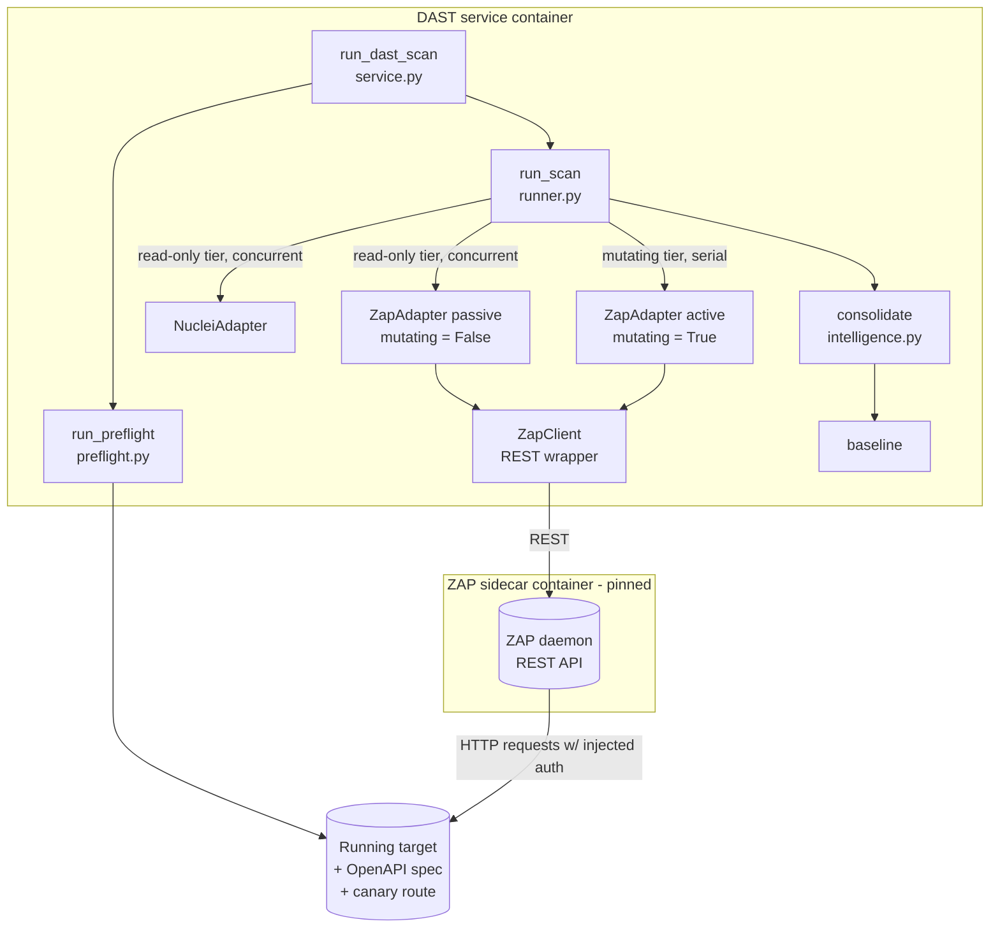

# Design Document

## Overview

Phase 3 adds OWASP ZAP as a dynamic scanner to the existing standalone DAST
service. Where the `NucleiAdapter` answers "are we exposed to anything already
publicly known?", the new `ZapAdapter` answers "does *our own code* have injection,
XSS, or access-control flaws?".

The single hardest fact about ZAP shapes the entire design: **ZAP only attacks URLs
already on its internal site tree.** Hand it three endpoints and it checks three and
reports "all secure" while the rest of the app goes untested. An unseeded ZAP scan
returns zero findings and exits successfully — a false all-clear. Making that failure
mode *impossible to report as clean* is the core of this work, and it plugs directly
into the Phase 2 liveness/trust model that already exists (`_assess_activity`,
`ToolActivity`, `ToolCoverage`, the canary, and the baseline).

This design reuses the existing architecture rather than reinventing it:

- The `ZapAdapter` implements the existing `DastAdapter` protocol
  (`name`, `mutating`, `scan(scope) -> ScanOutcome`) from `dast/models.py`.
- It plugs into the existing two-tier `run_scan` runner (`dast/runner.py`): passive
  scanning declares `mutating = False` (concurrent, read-only tier); active scanning
  declares `mutating = True` (serial tier).
- Its findings flow through the same `normalize → dedupe → baseline` chain
  (`dast/intelligence.py`, `dast/adapters/base.make_web_location`,
  `dast/urls.endpoint_identity`) with stable `finding_id`s, exactly like nuclei.
- It mirrors the `NucleiAdapter` structure: an impure `scan()` that drives the tool
  and a pure `parse()` classmethod over ZAP's alert JSON, so parsing is unit-testable
  from a saved fixture with no network.
- ZAP runs as a long-lived **pinned sidecar container** in daemon mode, driven over
  its REST API, so no per-scan JVM startup cost is paid — mirroring how nuclei's
  binary and templates are baked into `Dockerfile.dast`.

### Key design decisions

- **Profile selects passive-vs-active by constructing different adapter instances.**
  A single adapter instance carries exactly one `mutating` flag, and the runner reads
  that flag once to decide the tier. Rather than making one instance change its flag
  mid-scan (which the runner cannot observe), `default_adapters(profile)` becomes
  profile-aware and constructs a passive `ZapAdapter` for `fast`, and both a passive
  and an active `ZapAdapter` for `deep`. See [Profile handling](#profile-handling).
- **A shared ZAP client, two adapter faces.** The REST plumbing lives in a
  `ZapClient` helper; the passive and active adapters are thin wrappers that differ
  only in their `mutating` flag and which scan phase they drive. This keeps session
  setup, seeding, auth injection, and alert collection defined once.
- **Advisory-only active findings require a small model addition.** The shared
  `Finding` has no "advisory" concept. We add one optional field
  (`advisory: bool = False`) so active-scan findings can be marked non-blocking
  without disturbing nuclei or the SAST pipeline. See [Data Models](#data-models).

## Architecture

### Where ZAP sits in the existing flow



### How one ZAP scan flows

```mermaid
sequenceDiagram
    participant R as run_scan (runner)
    participant A as ZapAdapter
    participant C as ZapClient
    participant Z as ZAP daemon
    participant T as Target

    R->>A: scan(scope)
    A->>C: reachable()?  (REST ping)
    alt sidecar unreachable
        C-->>A: error
        A-->>R: raise ScannerError -> incomplete coverage
    end
    A->>C: new_session()  (fresh, empty site tree + alerts)
    A->>C: exclude_from_scan(logout_pattern)
    A->>C: set_replacer_rule(Authorization: <auth_header>)
    A->>C: import_openapi(spec_paths / spec URL)
    C->>Z: import + spider
    Z->>T: seed requests (with auth header)
    A->>C: canary_detected()?  (start-of-scan check)
    A->>C: passive_scan_wait()  (Fast + Deep)
    opt Deep profile AND non-production target
        A->>C: active_scan()  (mutating; sends payloads)
        Z->>T: attack payloads (rate-limited, auth header)
    end
    A->>C: alerts()  + messages/stats  + canary_detected()? (end-of-scan)
    C-->>A: raw alert JSON + request counts
    A->>A: parse(alerts, spec_paths) -> Finding[]
    A-->>R: ScanOutcome(findings, ToolActivity)
    R->>R: _assess_activity -> complete | incomplete
```

The critical property visible here: the `ToolActivity` the adapter returns carries
the real count of requests ZAP sent to the target (`requests_made`) and how many
failed (`request_errors`), plus canary and endpoint-coverage evidence. The existing
`_assess_activity` in `runner.py` already turns `requests_made == 0` or
`request_errors >= requests_made` into an `incomplete` coverage entry — so an
unseeded or blind ZAP scan cannot render as a clean report without any new runner
logic. The adapter's job is to *report honest numbers* and to surface the
ZAP-specific failure modes (unseeded map, canary regression) as `ScannerError` or as
a zeroed/short activity record.

## Components and Interfaces

### ZapClient (REST wrapper)

A thin, synchronous wrapper over ZAP's REST API using `httpx` (already a dependency).
It owns no scan policy — it just exposes the ZAP operations the adapter needs, keyed
by ZAP API key, host, and port from config. All methods raise `ScannerError` on
transport failure so callers do not have to distinguish httpx exceptions.

Conceptual operations (mapped to ZAP REST components):

| Purpose | ZAP REST operation (conceptual) |
| --- | --- |
| Confirm sidecar reachable | `core.version` |
| Fresh session per scan | `core.newSession` (name unique per scan) |
| Exclude logout URL | `core.excludeFromProxy` + `spider.excludeFromScan` + `ascan.excludeFromScan` |
| Inject auth header on every request | `replacer.addRule` (match `Authorization`, replacement = `auth_header`) |
| Seed site tree from spec | `openapi.importUrl` (spec URL) or `openapi.importFile`; fallback `spider.scan` |
| Passive scan | drive traffic + `pscan.recordsToScan` polled to 0 |
| Active scan | `ascan.scan` (started), polled via `ascan.status` |
| Fetch alerts | `core.alerts` / `alert.alerts` (paged) |
| Fetch request evidence | `core.numberOfMessages` / `stats.allSitesStats` (requests sent, errors) |
| Canary detection | query alerts/site-tree for the configured canary path |

The exact endpoint names are an implementation detail; the design commitment is that
**every outgoing target request carries the auth header** (via a replacer rule, so it
applies uniformly to seeding, passive, and active traffic — satisfying Req 3.3), and
that **request evidence is read from ZAP's own counters**, not inferred.

### ZapAdapter

Implements `DastAdapter`. Two construction modes, selected by the profile:

```python
class ZapAdapter:
    name: str            # "zap-passive" or "zap-active"
    mutating: bool       # False for passive, True for active

    def __init__(self, *, active: bool, client: ZapClient | None = None,
                 settings: DastSettings = dast_settings) -> None: ...

    def scan(self, scope: DastScope) -> ScanOutcome:   # impure: drives ZAP
        ...

    @classmethod
    def parse(cls, alerts: Sequence[Any], *,
              spec_paths: Iterable[str] = (),
              scanner_name: str = "zap",
              advisory: bool = False) -> list[Finding]:  # pure
        ...
```

- **`name`** is `"zap-passive"` or `"zap-active"` so the two tiers appear as distinct
  entries in `coverage` and in the baseline. Both share the same `rule_id`/endpoint
  identity chain, so a finding seen passively and confirmed actively still dedupes to
  one `finding_id`.
- **`mutating`** is `False` for passive (runs concurrently in the read-only tier with
  nuclei) and `True` for active (serialised) — satisfying Req 9.1/9.2 and the runner's
  contract that the tier is declared on the adapter.
- **`scan()`** orchestrates the sequence in the diagram: reachability → fresh session
  → exclusions → auth rule → seed → start-canary → scan phase → alerts + evidence →
  end-canary → build `ScanOutcome`.
- **`parse()`** is pure and deterministic over ZAP's alert JSON, exactly mirroring
  `NucleiAdapter.parse`. It builds shared `Finding` objects via `make_web_location`
  (which calls `endpoint_identity`, templatising URLs against `scope.spec_paths`).

### scan() sequence in detail

1. **Reachability (Req 1.3, 13.1):** `client.reachable()`; on failure raise
   `ScannerError` so `_run_one` records `incomplete`.
2. **Fresh session (Req 2.1, 2.2):** `client.new_session(scan_id)`. A fresh session
   has an empty site tree and no alerts, so last week's findings cannot bleed in. On
   failure raise `ScannerError` (Req 2.3).
3. **Logout exclusion (Req 4.1):** register the configured `DAST_ZAP_LOGOUT_EXCLUDE`
   pattern as excluded on spider + active scan + proxy *before* any traffic.
4. **Auth injection (Req 3.1–3.3):** when `scope.auth_header` is set, add a ZAP
   replacer rule setting `Authorization` on every outgoing request. When unset, scan
   anonymously (Req 3.2).
5. **Seed the site tree (Req 5.1–5.4):** if `scope.spec_paths` is non-empty, import
   the OpenAPI spec (by URL, derived from `target_url` + `DAST_OPENAPI_PATH`, so the
   import itself carries auth). Record the count of endpoints added. If `spec_paths`
   is empty, do **not** silently continue as clean — record an `incomplete` outcome
   with reason "site tree not seeded from spec" (Req 5.3).
6. **Start-of-scan canary (Req 7.1, 7.3):** confirm the canary path is detectable. If
   not, the scanner's own detection is broken → `incomplete` (Req 7.3).
7. **Passive scan (Req 6.1):** always runs (both profiles). Wait for ZAP's passive
   queue to drain.
8. **Active scan (Req 6.3):** only on the active adapter (deep profile) **and** only
   when the target is not a production target. If active is requested against a
   production target, refuse and record the refusal (Req 6.4).
9. **Collect alerts + evidence (Req 8.1, 9.3):** fetch alerts; read `requests_made`
   and `request_errors` from ZAP's counters into `ToolActivity`.
10. **End-of-scan canary (Req 7.2, 7.4, 7.5):** re-check the canary. Passed-at-start
    but missing-at-end → something began blocking mid-scan → `incomplete` (Req 7.4).
    Detected at both ends → record `canary_passed = True`.
11. **Endpoint-coverage tolerance (Req 10.1, 10.2):** compare discovered endpoint
    count against `len(spec_paths)`; if below the configured tolerance, mark the
    outcome under-seeded/`incomplete`.
12. **Build ScanOutcome:** `findings = parse(alerts, spec_paths, advisory=active)`,
    plus the populated `ToolActivity`.

### How incomplete is signalled

There are two channels, both already honoured by the runner and service, and the
adapter uses whichever fits the failure:

- **Hard failures** (unreachable sidecar, failed session start, unseeded map, canary
  broken at start, canary regression, mid-scan disconnect) → raise `ScannerError`.
  `_run_one` catches it and records an `incomplete` `ToolCoverage` with the reason,
  and the scan continues with the other tools (Req 13.3).
- **Soft evidence** (zero requests, all requests failed, timeout flood, under-seeded
  map) → return a `ScanOutcome` whose `ToolActivity` carries the honest numbers and
  let the existing `_assess_activity` classify it `incomplete`. Under-seeding is
  surfaced by raising `ScannerError` with an explicit reason, because the spec count
  is known only to the adapter and `_assess_activity` cannot compute it.

This split means most trust guarantees are enforced by code that already exists and
is already tested; the ZapAdapter's obligation is to report truthfully.

## Data Models

The design reuses `DastScope`, `ScanOutcome`, `ToolActivity`, `ToolCoverage`,
`DastResult`, and `Finding` unchanged in shape except for the additions below.

### New configuration (`dast/config.py`, `DAST_ZAP_*`)

| Setting | Default | Purpose | Requirement |
| --- | --- | --- | --- |
| `DAST_ZAP_HOST` | `127.0.0.1` | Sidecar host for the REST API | 1.1, 1.4 |
| `DAST_ZAP_PORT` | `8090` | Sidecar port for the REST API | 1.1, 1.4 |
| `DAST_ZAP_API_KEY` | `None` | ZAP API key for REST auth | 1.1 |
| `DAST_ZAP_IMAGE` | pinned digest, e.g. `ghcr.io/zaproxy/zaproxy@sha256:...` | Pinned sidecar image reference | 11.1, 11.2 |
| `DAST_ZAP_LOGOUT_EXCLUDE` | `.*/logout.*` | Regex of URLs excluded from scanning | 4.1, 4.3 |
| `DAST_ZAP_RATE_LIMIT` | `50` | Max requests/sec to a single-worker target | 12.1, 12.2 |
| `DAST_ZAP_COVERAGE_TOLERANCE` | `0.8` | Min fraction of spec endpoints that must be discovered | 10.1, 10.2 |
| `DAST_ZAP_CANARY_PATH` | `/canary/xss` | Path of the deliberately vulnerable canary endpoint | 7.x, 10.3 |
| `DAST_ZAP_TIMEOUT` | `1800` | Hard ceiling for one ZAP scan phase (seconds) | 12.3 |
| `DAST_ZAP_TIMEOUT_THRESHOLD` | `20` | Timeout count above which coverage is `incomplete` | 12.3 |
| `DAST_ZAP_PROD_URL_PATTERN` | `None` | Regex identifying a production target (active-scan refusal) | 6.4 |

All are `DAST_`-prefixed to avoid collision with the SAST `SECURITY_*` settings,
consistent with the existing file.

### Finding: new `advisory` field (`app/security/models.py`)

Active-scan findings must not block a release (Req 6.5). The shared `Finding`
currently has no such concept. The minimal, non-breaking change is one optional
field defaulting to `False`:

```python
@dataclass(frozen=True)
class Finding:
    scanner: str
    rule_id: str
    location: Location
    severity: Severity
    message: str
    raw: Mapping[str, object]
    category: str | None = None
    advisory: bool = False   # NEW: true = report-only, never gate a release
```

Because it defaults to `False`, nuclei and every SAST adapter are unaffected. The
passive `ZapAdapter` produces findings with `advisory=False`; the active `ZapAdapter`
produces `advisory=True`. Normalisation carries the flag through so the eventual gate
(Phase 5) can honour it. This is the only change to a shared model.

### ToolActivity: canary and seeding evidence

`ToolActivity` already records `units_executed`, `requests_made`, `request_errors`,
`timeouts`, `exit_code`, and `duration_seconds`. Two ZAP-specific facts need a home:
the canary verification result and the seeded-endpoint count. Rather than widen the
shared model with fields only ZAP uses, the design maps them onto existing fields
plus the coverage `reason`:

- **Seeded endpoint count → `units_executed`.** For ZAP, the "units" it executed are
  the endpoints it put on the map. This keeps the existing `units_executed == 0 →
  incomplete` check meaningful (an empty map is zero units).
- **Canary result → coverage `reason`.** A failed canary raises `ScannerError` whose
  `reason` is recorded on the `ToolCoverage`; a passed canary is noted in the success
  path's log and left implicit in a `complete` status. If richer structured evidence
  is wanted later, `ToolActivity` can gain an optional `notes: tuple[str, ...] = ()`
  field, but the current models express everything the requirements need without it.

This keeps the data-model footprint to exactly one new `Finding` field plus the new
config settings.

### Profile handling

`default_adapters(profile)` in `dast/runner.py` becomes profile-aware:

```python
def default_adapters(profile: str = "fast") -> list[DastAdapter]:
    adapters: list[DastAdapter] = [NucleiAdapter()]
    adapters.append(ZapAdapter(active=False))          # passive: both profiles
    if profile == "deep":
        adapters.append(ZapAdapter(active=True))       # active: deep only
    return adapters
```

The runner then tiers them automatically: the passive ZAP joins nuclei in the
concurrent read-only tier; the active ZAP runs in the serial mutating tier. This is
why profile selection is expressed as *which instances exist*, not as a flag toggled
at runtime — the runner reads `mutating` once, so one instance = one tier.

### Production-target detection and active-scan refusal

When `DAST_ZAP_PROD_URL_PATTERN` is set and matches `scope.target_url`, the active
`ZapAdapter.scan()` refuses to run the active phase: it does **not** send attack
payloads, and it returns a `ScanOutcome` recorded as `incomplete` with reason
"active scan refused against production target" (Req 6.4). The passive adapter is
unaffected and still runs, so production still gets passive coverage.

## Correctness Properties

*A property is a characteristic or behavior that should hold true across all valid
executions of a system — essentially, a formal statement about what the system should
do. Properties serve as the bridge between human-readable specifications and
machine-verifiable correctness guarantees.*

PBT is appropriate here because the parse layer is a pure function over ZAP's alert
JSON, URL templatisation and identity are pure transforms, and the trust rules
(auth-on-every-request, exclusions, canary boundaries, seeding, activity → coverage,
profile/production safety) are universal invariants that must hold across arbitrary
inputs. The tool-driving I/O layer (`ZapClient` talking to a live ZAP) is verified by
integration tests instead — see the Testing Strategy.

The properties below were derived from the prework analysis, with redundant criteria
consolidated (e.g. all five canary criteria fold into one boundary property; the
several "activity → incomplete" criteria fold into one runner-trust property).

### Property 1: parse() is pure and deterministic

*For any* sequence of ZAP alert objects and any `spec_paths`, calling
`ZapAdapter.parse` twice with the same arguments produces equal `Finding` lists, and
the call performs no network or filesystem I/O.

**Validates: Requirements 8.1**

### Property 2: parsed findings are fully populated

*For any* well-formed ZAP alert, the resulting `Finding` carries a non-empty scanner
name, a stable `rule_id`, a web `Location`, a `Severity`, and a message.

**Validates: Requirements 8.1**

### Property 3: URL templatisation yields stable finding identity

*For any* endpoint template in `spec_paths` and any two concrete URLs that differ only
in their dynamic segments (e.g. `/api/users/12345` vs `/api/users/67890`), the
`Finding`s produced by `parse()` share the same endpoint identity and therefore the
same `finding_id`.

**Validates: Requirements 8.2**

### Property 4: duplicate alerts collapse to one finding

*For any* ZAP alert repeated any number of times (same rule identity and endpoint
identity), `consolidate` over the parsed findings yields exactly one finding for that
identity.

**Validates: Requirements 8.3, 8.4**

### Property 5: the auth header is injected on every outgoing request

*For any* set of endpoints ZAP contacts, when `DastScope.auth_header` is set, every
outgoing request the adapter causes ZAP to make to the target — including the requests
used to seed the site tree, passive traffic, and active traffic — carries the
configured `Authorization` value.

**Validates: Requirements 3.1, 3.3, 5.4**

### Property 6: the logout URL is never requested

*For any* set of candidate URLs, when a logout exclusion pattern is configured, none
of the requests the adapter causes ZAP to send match the exclusion pattern.

**Validates: Requirements 4.1, 4.2**

### Property 7: a fresh session carries no prior state

*For any* prior ZAP session contents (arbitrary alerts and site-tree entries), after
the adapter starts a new session the session's alerts and site tree are empty before
seeding begins.

**Validates: Requirements 2.1, 2.2**

### Property 8: seeding covers the spec and records its count

*For any* non-empty `spec_paths`, after seeding, the site tree contains an endpoint
for every spec path, and the recorded seeded-endpoint count (`units_executed`) equals
the number of endpoints added.

**Validates: Requirements 5.1, 5.2**

### Property 9: an under-seeded map is reported incomplete

*For any* spec-declared endpoint count N and discovered endpoint count D, the ZAP
outcome is marked `incomplete` (under-seeded) exactly when D is below
`DAST_ZAP_COVERAGE_TOLERANCE * N`.

**Validates: Requirements 10.1, 10.2**

### Property 10: coverage is complete only when the canary fires at both boundaries

*For any* pair of canary detection outcomes `(detected_at_start, detected_at_end)`,
the ZAP scan yields a `complete` result only when both are true; if the canary is
undetected at the start, or detected at the start but not at the end, the result is
`incomplete`.

**Validates: Requirements 7.1, 7.2, 7.3, 7.4, 7.5**

### Property 11: no request evidence means no clean result

*For any* `ToolActivity` a ZAP scan returns, the runner marks the coverage
`incomplete` whenever `requests_made == 0`, or `request_errors >= requests_made`, or
the timeout count exceeds the configured threshold; a `complete` result is only
possible when real request evidence exists.

**Validates: Requirements 9.3, 9.4, 9.5, 12.3**

### Property 12: active scanning never runs under the fast profile

*For any* scope with `profile == "fast"`, the adapter set contains no active ZAP
adapter and no active-scan attack traffic is initiated.

**Validates: Requirements 6.1, 6.2**

### Property 13: active scanning never runs against a production target

*For any* target URL matching the configured production pattern, the active adapter
sends zero attack payloads and records the refusal.

**Validates: Requirements 6.4**

### Property 14: active findings are advisory, passive findings are not

*For any* set of ZAP alerts, findings parsed for an active scan all have
`advisory == True`, and findings parsed for a passive scan all have
`advisory == False`.

**Validates: Requirements 6.5**

### Property 15: one failing tool never aborts the scan

*For any* adapter that raises during its scan, `run_scan` still records an
`incomplete` coverage entry for it and still runs and reports every other tool.

**Validates: Requirements 13.1, 13.2, 13.3**

## Error Handling

The service already has a robust, tested failure model; ZAP plugs into it.

- **Sidecar unreachable at start (Req 13.1):** `scan()` calls `client.reachable()`
  first. On failure it raises `ScannerError`; `_run_one` records `incomplete` and the
  scan continues with other tools.
- **Fresh-session start fails (Req 2.3):** raise `ScannerError` with the ZAP reason.
- **Sidecar disconnects mid-scan (Req 13.2):** any REST call failing after the scan
  starts is wrapped as `ScannerError` — never swallowed into an empty-but-clean
  result. The partial alerts collected so far are discarded in favour of an honest
  `incomplete`.
- **Unseeded map (Req 5.3) / under-seeded map (Req 10.2):** raise `ScannerError` with
  an explicit reason ("site tree not seeded from spec" / "map under-seeded: D of N
  endpoints"), because the spec count is knowledge only the adapter has.
- **Canary broken at start / regressed mid-scan (Req 7.3, 7.4):** raise `ScannerError`
  with a reason distinguishing "scanner's own detection is not working" from
  "something began blocking the scanner mid-scan".
- **Zero requests / all-errors / timeout flood (Req 9.4, 9.5, 12.3):** return a
  truthful `ToolActivity`; the existing `_assess_activity` classifies it `incomplete`.
- **Active scan requested against production (Req 6.4):** refuse, send no payloads,
  return an `incomplete` outcome recording the refusal.
- **Unexpected exceptions:** `_run_one`'s catch-all already converts any unforeseen
  error into an `incomplete` entry, so a ZAP bug degrades to "unverified", never to a
  false "clean".

Every path above results in either a `complete` coverage entry backed by real request
evidence, or an `incomplete` entry with a human-readable reason. There is no path that
yields a clean, empty, `complete` ZAP result without the scanner having demonstrably
reached and exercised the target — which is the whole point of Phase 2's trust model
and this feature's core obligation.

## Testing Strategy

A dual approach: property-based tests for the pure logic and universal invariants,
example/integration tests for the I/O boundary and specific error conditions.

### Property-based tests

- **Library:** Hypothesis (already used in this repo — see `tests/security/` and the
  `.hypothesis` cache), so we do not implement PBT from scratch.
- **Iterations:** each property test runs a minimum of 100 examples (Hypothesis
  default `max_examples` ≥ 100).
- **Tagging:** each property test is tagged with a comment referencing its design
  property, in the format:
  `# Feature: dast-zap, Property {number}: {property_text}`.
- **Fakes over network:** Properties that involve driving ZAP (auth injection, logout
  exclusion, fresh session, seeding, canary boundaries) run against an **in-memory
  fake ZAP** that records the requests it would send and the session state it holds,
  so the invariant is checked over arbitrary generated inputs with no network. The
  `ZapClient` is written against a narrow interface so the fake substitutes cleanly.
- **Generators:**
  - ZAP alert objects (varying rule id, url with/without dynamic segments, severity,
    param, message) for Properties 1–4, 14.
  - spec-path templates + concrete id substitutions for Property 3, 8.
  - URL sets with a mix of logout-matching and non-matching URLs for Property 6.
  - arbitrary prior session contents for Property 7.
  - `(spec_count, discovered_count)` pairs for Property 9.
  - `(start_detected, end_detected)` booleans for Property 10.
  - `ToolActivity` field combinations for Property 11.
  - profiles and production/non-production URLs for Properties 12, 13.
  - failing/succeeding adapter stubs for Property 15.

Each of the 15 correctness properties is implemented by a single property-based test.

### Unit tests (example / edge / smoke)

- **Saved ZAP alert fixture** (`tests/dast/fixtures/zap_alerts.json`): a captured ZAP
  `core.alerts` payload driving `parse()` example tests — the exact mirror of the
  nuclei fixture approach. Confirms real ZAP field names map correctly.
- Reachability precondition (Req 1.3): reachable → proceeds; unreachable → raises
  before any scan command is issued.
- No per-scan process start (Req 1.2) and REST-only wiring (Req 1.1, 1.4): smoke tests.
- Anonymous scanning when `auth_header` is unset (Req 3.2): no replacer rule added.
- Empty `spec_paths` → `incomplete` with "not seeded" reason (Req 5.3).
- Deep + non-production → active phase initiated (Req 6.3); `default_adapters("fast")`
  includes `zap-passive` and excludes `zap-active` (Req 10.4); tier flags
  (Req 9.1, 9.2).
- Rate limit applied to ZAP scan policy (Req 12.2) and pinned image assertion — the
  configured `DAST_ZAP_IMAGE` is a digest/version, never `latest` (Req 11.1, 11.2).
- Mid-scan disconnect → `incomplete` (Req 13.2).

### Integration tests (against a real ZAP sidecar)

Run in CI against the pinned ZAP sidecar plus a deliberately vulnerable target
(e.g. the canary staging build / OWASP Juice Shop). These verify the wiring the fakes
cannot:

- **Canary XSS is reported (Req 10.3):** a deep scan against a build containing the
  canary route produces the expected XSS finding — the end-to-end proof the alarm
  works.
- **Seeding from a real spec (Req 5.1, 10.1):** importing a real OpenAPI spec produces
  a discovered endpoint count within tolerance of the declared count.
- **Passive on fast (Req 10.4):** a fast-profile scan produces a `zap-passive`
  coverage entry with real `requests_made`.
- 1–3 examples each; not run 100×, because these test ZAP and the network, not our
  input-varying logic.

### Deployment

ZAP ships as a **pinned sidecar** in `docker-compose`, alongside the DAST service,
mirroring the `Dockerfile.dast` pattern (binary/version baked and pinned, upgraded via
reviewed PR):

```yaml
services:
  dast:
    build:
      context: .
      dockerfile: Dockerfile.dast
    environment:
      DAST_ZAP_HOST: zap
      DAST_ZAP_PORT: "8090"
      DAST_ZAP_API_KEY: ${DAST_ZAP_API_KEY}
      DAST_ZAP_CANARY_PATH: /canary/xss
    depends_on:
      - zap
  zap:
    # Pinned by digest, never :latest — the tool deciding whether a build passes
    # cannot change without a reviewed change (Req 11.1, 11.2).
    image: ghcr.io/zaproxy/zaproxy@sha256:<pinned-digest>
    command: >
      zap.sh -daemon -host 0.0.0.0 -port 8090
      -config api.key=${DAST_ZAP_API_KEY}
    expose:
      - "8090"
```

The DAST service reaches the daemon at `zap:8090` over the compose network; the daemon
stays warm across scans, so no per-scan JVM startup cost is paid (Req 1.1, 1.2).
