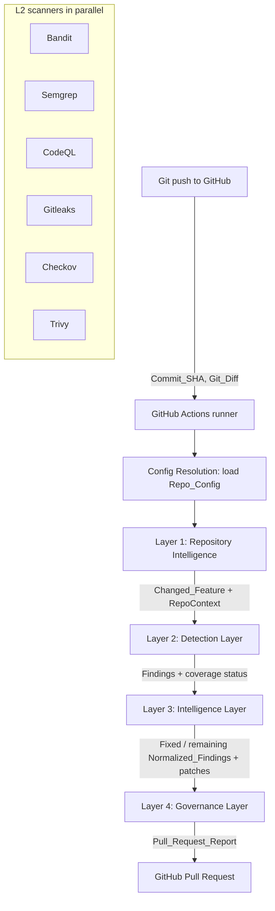
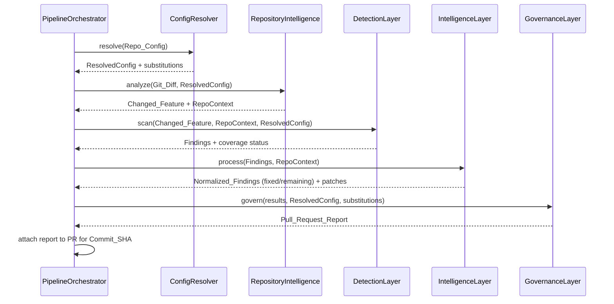

# Design Document

## Overview

The DeliveryOS Security Pipeline is a GitHub Actions–orchestrated system that runs on every Git push and produces a security-reviewed Pull Request annotated with an advisory merge confidence score. It implements a strict "deterministic-first" philosophy: deterministic scanners discover vulnerabilities, AI reasons about and proposes fixes, deterministic scanners verify those fixes, and a governance layer decides readiness to merge. AI augments the scanners; it never replaces them, and no code is ever merged without a human decision.

The system is implemented in **Python** and organized into four cooperating layers executed strictly in order:

1. **Repository Intelligence** (Layer 1) — narrows analysis to the code affected by the current commit and builds the surrounding context (AST, symbol index, call graph, dependency graph).
2. **Detection Layer** (Layer 2) — runs six specialized deterministic scanners in parallel, scoped to the changed feature.
3. **Intelligence Layer** (Layer 3) — normalizes, deduplicates, enriches, scores, triages, repairs, and re-verifies findings.
4. **Governance Layer** (Layer 4) — enforces the configurable Quality Gate, computes merge confidence, and generates the Pull Request report.

This design intentionally separates **deterministic, testable logic** (normalization, deduplication, risk scoring, quality gate evaluation, verification accept/reject, merge confidence) from **non-deterministic AI stages** (triage, repair) and **external I/O boundaries** (scanner subprocesses, SonarQube, GitHub API). The deterministic core is expressed as pure functions over well-defined data models so that it can be exhaustively validated with property-based testing, while the AI and I/O boundaries are isolated behind interfaces and validated with example/integration tests and mocks.

### Design Principles

- **Determinism at the edges of AI**: every AI stage is bracketed by deterministic verification. AI output never changes a computed `Risk_Score` or triggers a merge.
- **Fail-open on scanner/parse errors, fail-closed on merge**: a single scanner or unparseable file does not abort the pipeline; instead coverage is marked incomplete. But a failed Quality Gate never yields an automatic merge.
- **Configuration is data**: `Repo_Config` overrides are resolved once, up front, with malformed values replaced by documented defaults and the substitution surfaced in the report.
- **Pure core, impure shell**: transformation logic is pure and property-tested; side effects (subprocess, network, git) live in thin adapters.

### Requirements Traceability Summary

| Requirement | Primary design location |
|---|---|
| 1. Trigger & Orchestration | Architecture → Orchestration Flow; `PipelineOrchestrator` |
| 2. Repository Intelligence | Components → Layer 1; `Changed_Feature`, `RepoContext` |
| 3. Detection – parallel scanning | Components → Layer 2; `ScannerRunner` |
| 4. Detection – scanner coverage | Components → Layer 2; per-scanner adapters |
| 5. Normalization | Components → Layer 3 Normalization; `Normalized_Finding` |
| 6. Deduplication | Components → Layer 3 Deduplication |
| 7. Context enrichment | Components → Layer 3 Enrichment |
| 8. Risk scoring | Components → Layer 3 Scoring; `Risk_Score` |
| 9. AI triage | Components → Layer 3 Triage |
| 10. AI repair | Components → Layer 3 Repair |
| 11. Verification | Components → Layer 3 Verification |
| 12. Quality Gate | Components → Layer 4 Quality Gate; `Quality_Gate` |
| 13. Merge Confidence | Components → Layer 4; `Merge_Confidence` |
| 14. Pull Request Report | Components → Layer 4; `Pull_Request_Report` |
| 15. Configuration Management | Architecture → Config Resolution; `Repo_Config` |

## Architecture

### Layered Pipeline



### Orchestration Flow

The `PipelineOrchestrator` is the top-level coordinator (Requirement 1). Its responsibilities:

1. **Input acquisition** — obtain `Commit_SHA` and `Git_Diff` from the GitHub Actions event context. If either is unavailable, halt and emit a diagnostic error naming the missing input (1.3).
2. **Config resolution** — load and validate `Repo_Config` before the Detection Layer runs (1.5, 15). Produces a fully-resolved `ResolvedConfig` plus a list of `ConfigSubstitution` records for any malformed values.
3. **Sequential layer execution** — run Layer 1 → 2 → 3 → 4 in strict order (1.2). Each layer receives the previous layer's typed output.
4. **Error containment** — if any layer raises an unrecoverable error, stop subsequent layers and still produce a `Pull_Request_Report` stating which layer failed (1.4). Scanner-level and parse-level failures are recoverable and do not abort (2.6, 3.4).



### GitHub Actions Execution Context

- The pipeline runs as a workflow triggered on `push` (and re-runs on the PR branch after patches are committed).
- The workflow checks out the repository at `Commit_SHA` with sufficient history to compute `Git_Diff` against the base ref.
- Scanners run as steps/subprocesses on the runner; CodeQL and Trivy may use their official actions/containers. Each scanner writes machine-readable output (SARIF or JSON) that the Detection Layer adapters parse.
- SonarQube metrics are retrieved from a SonarQube server/SonarCloud via its web API using a project token stored as an Actions secret.
- The Pull Request Report is posted to the PR associated with `Commit_SHA` via the GitHub API (using the workflow token). Verified patches are committed to the PR branch; merge remains a manual human action (10.3, 13.3, 14.5).

### Config Resolution

Configuration is resolved once, before detection (1.5, 15). The resolver:

- Reads the `Repo_Config` file if present; otherwise uses all defaults (15.3).
- Validates each field against its schema. A malformed value is rejected, replaced by the default, and recorded as a `ConfigSubstitution` (15.2) that later appears in the report.
- Produces a single immutable `ResolvedConfig` consumed by all layers (thresholds, scanner rule settings, pipeline settings).

### Component / Layer Boundaries

Each layer is a module with a single public entry function operating on immutable dataclasses. Impure operations (subprocess execution, HTTP, git, filesystem) are confined to adapter classes injected into each layer, enabling deterministic unit and property testing of the core logic with mocked adapters.

## Components and Interfaces

Interfaces below are shown in Python using dataclasses and Protocols. Signatures illustrate contracts; full types appear in Data Models.

### Layer 1 — Repository Intelligence

Purpose: turn a `Git_Diff` into a `Changed_Feature` plus related repository context (Requirement 2).

```python
class RepositoryIntelligence:
    def analyze(self, git_diff: GitDiff, config: ResolvedConfig) -> RepoContext:
        """Requirement 2.1–2.6"""
```

Responsibilities and stages:

- **Change extraction** (2.1): parse the `Git_Diff` into changed files, and within them the changed functions and classes, forming the `Changed_Feature`.
- **AST construction** (2.2): build a Python AST for each changed file using the standard library `ast` module.
- **Graph construction** (2.3): build a `symbol_index`, `call_graph`, and `dependency_graph` for the changed feature.
- **Related-symbol resolution** (2.4): traverse the call graph and dependency graph to collect symbols related to the changed feature (callers, callees, imported modules).
- **Output** (2.5): emit `RepoContext` bundling `Changed_Feature`, graphs, and related symbols for later layers.
- **Unparseable handling** (2.6): if a file cannot be parsed, record it in `unparseable_files` and continue with the rest.

### Layer 2 — Detection Layer

Purpose: run six deterministic scanners in parallel, scoped to the changed feature, and collect all findings (Requirements 3, 4).

```python
class ScannerAdapter(Protocol):
    name: str
    def scan(self, scope: ScanScope) -> list[Finding]: ...

class DetectionLayer:
    def scan(self, ctx: RepoContext, config: ResolvedConfig) -> DetectionResult:
        """Runs adapters in parallel; returns Findings + per-scanner coverage."""
```

- **Parallel execution** (3.1): run Bandit, Semgrep, CodeQL, Gitleaks, Checkov, Trivy concurrently (e.g., `concurrent.futures` / matrixed GitHub jobs), each behind a `ScannerAdapter`.
- **Scoping** (3.2): each adapter is scoped to the `Changed_Feature` and related context via `ScanScope` (file/path list plus related symbols).
- **Collection** (3.3): once all scanners complete, aggregate every `Finding`.
- **Per-scanner failure isolation** (3.4): if an adapter fails, record a `ScannerCoverage` entry with `status = incomplete` and continue; the failure surfaces in the report (14.4).
- **Finding provenance** (3.5): every `Finding` records originating scanner, affected location, and scanner-assigned severity.

Scanner coverage responsibilities (Requirement 4) are encapsulated per adapter:

| Adapter | Coverage (4.x) |
|---|---|
| `BanditAdapter` | Python issues: unsafe subprocess/os.system, eval/exec, unsafe deserialization, weak crypto, hardcoded passwords, unsafe YAML (4.1) |
| `SemgrepAdapter` | Pattern issues: SQLi, command injection, XSS, SSRF, path traversal, authn/authz flaws, company rules (4.2) |
| `CodeQLAdapter` | Semantic/data-flow: multi-function SQLi, taint flow, authorization bypass, resource leaks (4.3) |
| `GitleaksAdapter` | Secrets: API keys, cloud creds, SSH keys, tokens, DB passwords, .env leaks (4.4) |
| `CheckovAdapter` | IaC: public cloud resources, weak IAM, open security groups, K8s misconfig, Terraform/CloudFormation risks (4.5) |
| `TrivyAdapter` | Dependencies/containers: dependency CVEs, container/filesystem vulns, K8s config, OS package vulns (4.6) |

Each adapter parses its tool's native output (SARIF/JSON) into the shared `Finding` type.

### Layer 3 — Intelligence Layer

Purpose: transform raw findings into scored, triaged, repaired, and re-verified results. The pure-logic stages (normalize, dedup, enrich, score) are deterministic; triage and repair are AI stages bracketed by deterministic verification.

```python
class IntelligenceLayer:
    def process(self, findings: list[Finding], ctx: RepoContext,
                config: ResolvedConfig) -> IntelligenceResult:
        ...
```

Stages (in order):

1. **Normalization** (Requirement 5) — `normalize(finding) -> Normalized_Finding` conforming to `Common_Schema`. Preserves scanner, location, severity (5.2). Missing required fields get a defined default and a `defaults_applied` record (5.3).
2. **Deduplication** (Requirement 6) — `deduplicate(findings) -> findings`. Findings describing the same vulnerability at the same location merge into one, and the merged finding retains the **set** of originating scanners (6.2). Distinct vulnerabilities are preserved (6.3). Dedup key = `(normalized_rule_identity, canonical_location)`.
3. **Enrichment** (Requirement 7) — attach `reachability` from the call graph (7.1), `business_criticality` from repo context (7.2), `exposure` ∈ {public, internal} (7.3), and `auth_context` (7.4).
4. **Risk scoring** (Requirement 8) — `Risk_Score = Severity × Reachability × Business_Criticality × Exploitability × Repository_Context` (8.1). Pure function of the scoring inputs, so identical inputs yield identical scores (8.2). Findings are ordered by `Risk_Score` descending for downstream processing (8.3).
5. **AI triage** (Requirement 9) — `AITriageAdapter.triage(finding, ctx) -> AITriage` produces explanation, priority, and suggested fix approach (9.1). If flagged a likely false positive, the finding is labeled but **retained** for human review (9.2). Triage is attached without altering the deterministic `Risk_Score` (9.3).
6. **AI repair** (Requirement 10) — for each scanner-confirmed finding not labeled a likely false positive, `AIRepairAdapter.repair(finding, ctx) -> CandidatePatch | None` generates a candidate patch (10.1) associated with its target finding (10.2). Patches are proposals only; never auto-merged (10.3). If no patch can be produced, the finding is marked `unresolved` with a recorded reason (10.4).
7. **Verification** (Requirement 11) — for each candidate patch, re-run the scanners against the patched code (11.1). Accept and mark `fixed` only if verification confirms the targeted finding is resolved (11.2). Reject and mark `unresolved` if resolution is not confirmed (11.3) **or** if the patch introduces any new finding (11.4).

The Intelligence Layer emits an `IntelligenceResult` partitioning findings into `fixed` and `remaining`, each carrying its triage, patch (if any), and status.

```python
class AITriageAdapter(Protocol):
    def triage(self, f: NormalizedFinding, ctx: RepoContext) -> AITriage: ...

class AIRepairAdapter(Protocol):
    def repair(self, f: NormalizedFinding, ctx: RepoContext) -> CandidatePatch | None: ...

class Verifier:
    def verify(self, patch: CandidatePatch, baseline: list[NormalizedFinding],
               scope: ScanScope) -> VerificationOutcome:
        """Accept iff target resolved AND no new finding introduced (11.2–11.4)."""
```

### Layer 4 — Governance Layer

Purpose: enforce the Quality Gate, compute merge confidence, and generate the Pull Request report (Requirements 12–14).

```python
class GovernanceLayer:
    def govern(self, result: IntelligenceResult, sonar: SonarMetrics,
               config: ResolvedConfig,
               substitutions: list[ConfigSubstitution],
               coverage: list[ScannerCoverage]) -> PullRequestReport:
        ...
```

- **Quality Gate evaluation** (Requirement 12): evaluate SonarQube metrics (maintainability, code smells, technical debt, security hotspots, coverage) plus pipeline findings against `Quality_Gate` thresholds (12.1). Repo_Config thresholds override defaults (12.2); otherwise defaults apply: zero critical findings, coverage ≥ 90%, zero leaked secrets, zero blocking IaC issues (12.3). Status = `passed` iff every threshold is satisfied (12.4); otherwise `failed` with each unsatisfied threshold recorded (12.5). This is a pure function of `(metrics, findings, thresholds)`.
- **Merge Confidence** (Requirement 13): `compute_merge_confidence(inputs) -> Merge_Confidence` derived deterministically from testing confidence, security confidence, coverage, remaining findings, and Quality Gate status (13.1). Identical inputs produce identical values (13.2). Recorded as advisory; never triggers an automatic merge (13.3).
- **Pull Request Report** (Requirement 14): build a `Pull_Request_Report` and post it to the PR for `Commit_SHA` (14.1). Includes testing summary, security summary, fixed findings, remaining findings, and merge confidence (14.2); Quality Gate status with unsatisfied thresholds when failed (14.3); any scanner marked incomplete (14.4); and config substitutions (15.2). The final merge decision is explicitly left to a human (14.5).

Adapters at this layer: `SonarClient` (fetch metrics) and `GitHubReporter` (post report / commit patches to PR branch).

### Repo_Config Handling

`ConfigResolver.resolve(raw: str | None) -> (ResolvedConfig, list[ConfigSubstitution])` centralizes configuration (Requirement 15) and feeds every layer. Malformed individual values are replaced by defaults and each substitution is recorded for the report; a fully absent config yields all defaults.

## Data Models

All models are immutable Python dataclasses (`frozen=True`) unless noted. Enumerations use `enum.Enum`.

### Inputs and Repository Context

```python
@dataclass(frozen=True)
class GitDiff:
    base_sha: str
    commit_sha: str            # Commit_SHA
    changed_paths: tuple[str, ...]
    hunks: tuple[DiffHunk, ...]

@dataclass(frozen=True)
class ChangedFeature:
    files: tuple[str, ...]
    functions: tuple[SymbolRef, ...]
    classes: tuple[SymbolRef, ...]
    related_symbols: tuple[SymbolRef, ...]   # from call/dependency graph (2.4)

@dataclass(frozen=True)
class RepoContext:
    commit_sha: str
    changed_feature: ChangedFeature
    symbol_index: Mapping[str, SymbolRef]
    call_graph: Graph            # 2.3
    dependency_graph: Graph      # 2.3
    unparseable_files: tuple[str, ...]   # 2.6
```

### Finding (raw, from scanners)

```python
class Severity(Enum):
    INFO = 1; LOW = 2; MEDIUM = 3; HIGH = 4; CRITICAL = 5

@dataclass(frozen=True)
class Location:
    path: str
    start_line: int
    end_line: int
    symbol: str | None = None

@dataclass(frozen=True)
class Finding:
    scanner: str                 # originating Scanner (3.5)
    rule_id: str
    location: Location           # affected location (3.5)
    severity: Severity           # scanner-assigned severity (3.5)
    message: str
    raw: Mapping[str, object]    # original tool payload
```

### Common_Schema / Normalized_Finding

```python
class FindingStatus(Enum):
    OPEN = "open"; FIXED = "fixed"; UNRESOLVED = "unresolved"

@dataclass(frozen=True)
class Normalized_Finding:                 # conforms to Common_Schema (Req 5)
    finding_id: str                        # stable id derived from identity
    rule_identity: str                     # normalized cross-scanner rule identity
    location: Location
    severity: Severity
    scanners: frozenset[str]               # set retained after dedup (6.2)
    category: str                          # code/secret/iac/dependency/container
    message: str
    defaults_applied: tuple[str, ...] = () # fields defaulted (5.3)
    # Enrichment (Req 7)
    reachability: float | None = None      # 7.1
    business_criticality: float | None = None  # 7.2
    exposure: Exposure | None = None       # 7.3 (public/internal)
    auth_context: AuthContext | None = None     # 7.4
    exploitability: float | None = None
    repository_context: float | None = None
    # Scoring (Req 8)
    risk_score: float | None = None
    # AI stages
    triage: "AITriage | None" = None       # 9.3 (does not affect risk_score)
    likely_false_positive: bool = False    # 9.2
    candidate_patch: "CandidatePatch | None" = None  # 10.2
    status: FindingStatus = FindingStatus.OPEN
    unresolved_reason: str | None = None   # 10.4 / 11.3

class Exposure(Enum):
    PUBLIC = "public"; INTERNAL = "internal"
```

### Risk_Score inputs

```python
@dataclass(frozen=True)
class RiskScoreInputs:
    severity: float
    reachability: float
    business_criticality: float
    exploitability: float
    repository_context: float

def compute_risk_score(i: RiskScoreInputs) -> float:
    # Risk_Score = Severity × Reachability × Business_Criticality
    #              × Exploitability × Repository_Context  (8.1)
    return (i.severity * i.reachability * i.business_criticality
            * i.exploitability * i.repository_context)
```

### AI Triage and Candidate Patch

```python
class Priority(Enum):
    P0 = 0; P1 = 1; P2 = 2; P3 = 3

@dataclass(frozen=True)
class AITriage:
    explanation: str
    priority: Priority
    suggested_fix: str
    likely_false_positive: bool

@dataclass(frozen=True)
class CandidatePatch:
    target_finding_id: str        # association to finding (10.2)
    diff: str                     # unified diff proposal (10.3 proposal-only)

@dataclass(frozen=True)
class VerificationOutcome:
    accepted: bool
    resolved_target: bool
    introduced_findings: tuple[str, ...]   # new finding ids (11.4)
```

### Quality_Gate

```python
@dataclass(frozen=True)
class QualityGateThresholds:
    max_critical_findings: int = 0          # default 0 (12.3)
    min_coverage_percent: float = 90.0      # default 90 (12.3)
    max_leaked_secrets: int = 0             # default 0 (12.3)
    max_blocking_iac_issues: int = 0        # default 0 (12.3)
    # SonarQube-derived thresholds (12.1)
    max_code_smells: int | None = None
    max_technical_debt_minutes: int | None = None
    max_security_hotspots: int | None = None
    min_maintainability_rating: str | None = None

class GateStatus(Enum):
    PASSED = "passed"; FAILED = "failed"

@dataclass(frozen=True)
class UnsatisfiedThreshold:
    name: str
    expected: str
    actual: str

@dataclass(frozen=True)
class Quality_Gate:
    status: GateStatus
    unsatisfied: tuple[UnsatisfiedThreshold, ...]   # populated when failed (12.5)

@dataclass(frozen=True)
class SonarMetrics:
    coverage_percent: float
    code_smells: int
    technical_debt_minutes: int
    security_hotspots: int
    maintainability_rating: str
```

### Merge_Confidence

```python
@dataclass(frozen=True)
class MergeConfidenceInputs:
    testing_confidence: float
    security_confidence: float
    coverage_percent: float
    remaining_findings: int
    quality_gate_status: GateStatus

@dataclass(frozen=True)
class Merge_Confidence:
    score: float                 # advisory (13.3)
    inputs: MergeConfidenceInputs
    advisory: bool = True
```

### Pull_Request_Report

```python
@dataclass(frozen=True)
class ScannerCoverage:
    scanner: str
    status: str                  # "complete" | "incomplete" (3.4, 14.4)
    reason: str | None = None

@dataclass(frozen=True)
class ConfigSubstitution:
    field: str
    provided: str
    applied_default: str         # 15.2

@dataclass(frozen=True)
class Pull_Request_Report:
    commit_sha: str
    testing_summary: str                          # 14.2
    security_summary: str                         # 14.2
    fixed_findings: tuple[Normalized_Finding, ...]     # 14.2
    remaining_findings: tuple[Normalized_Finding, ...] # 14.2
    merge_confidence: Merge_Confidence            # 14.2
    quality_gate: Quality_Gate                    # 14.3
    incomplete_scanners: tuple[ScannerCoverage, ...]   # 14.4
    config_substitutions: tuple[ConfigSubstitution, ...]  # 15.2
    failed_layer: str | None = None               # 1.4
```

### Repo_Config / ResolvedConfig

```python
@dataclass(frozen=True)
class ResolvedConfig:
    thresholds: QualityGateThresholds
    scanner_rules: Mapping[str, object]   # per-scanner rule settings (15.1)
    pipeline_settings: Mapping[str, object]
    # substitutions returned alongside from ConfigResolver.resolve()
```

## Correctness Properties

*A property is a characteristic or behavior that should hold true across all valid executions of a system — essentially, a formal statement about what the system should do. Properties serve as the bridge between human-readable specifications and machine-verifiable correctness guarantees.*

This feature contains a substantial deterministic core (normalization, deduplication, risk scoring, verification accept/reject, quality-gate evaluation, config resolution, merge-confidence determinism, report assembly) expressed as pure functions over immutable data models. That core is well suited to property-based testing. The AI stages (triage content, patch content) and the external I/O boundaries (scanner subprocesses, SonarQube, GitHub) are non-deterministic or side-effecting and are validated with example/integration tests instead (see Testing Strategy). The properties below are derived from the prework analysis and consolidated to remove redundancy; each is universally quantified and traces to the acceptance criteria it validates.

### Property 1: Layer-failure containment

*For any* choice of a single layer that raises an unrecoverable error, the Pipeline stops all subsequent layers (they are never invoked) and still produces a `Pull_Request_Report` whose `failed_layer` names exactly the failing layer.

**Validates: Requirements 1.4**

### Property 2: Change coverage

*For any* `Git_Diff` over parseable files, every changed path in the diff appears in `Changed_Feature.files`, and every changed function/class definition appears in `Changed_Feature.functions`/`classes`.

**Validates: Requirements 2.1**

### Property 3: Unparseable-file handling

*For any* set of changed files containing an arbitrary subset that cannot be parsed into an AST, `RepoContext.unparseable_files` equals exactly that unparseable subset and every remaining (parseable) file is still analyzed.

**Validates: Requirements 2.6**

### Property 4: Scanner scoping

*For any* `RepoContext`, the `ScanScope` passed to every scanner adapter equals the scope derived from that context (the changed feature's paths plus related symbols) — all adapters receive the same derived scope.

**Validates: Requirements 3.2**

### Property 5: Finding aggregation and provenance

*For any* collection of per-scanner finding lists produced when all scanners complete, the Detection_Layer's aggregated output equals the multiset union of those lists, and every aggregated `Finding` retains its originating scanner, affected location, and scanner-assigned severity.

**Validates: Requirements 3.3, 3.5**

### Property 6: Scanner-failure containment

*For any* subset of scanners chosen to fail, findings from every non-failing scanner are retained, and a scanner's coverage is marked `incomplete` if and only if that scanner is in the failing subset.

**Validates: Requirements 3.4**

### Property 7: Normalization conformance and preservation

*For any* raw `Finding` (including ones missing schema-required fields), `normalize` produces a `Normalized_Finding` that conforms to the `Common_Schema`, preserves the originating scanner, location, and severity, and for every missing required field assigns the documented default and records that field in `defaults_applied` (exactly the set of fields that were missing).

**Validates: Requirements 5.1, 5.2, 5.3**

### Property 8: Deduplication

*For any* set of `Normalized_Finding`s, deduplication collapses every group sharing the same `(rule_identity, canonical_location)` into a single finding whose `scanners` set equals the union of the group's originating scanners, while the number of output findings equals the number of distinct `(rule_identity, canonical_location)` groups (distinct vulnerabilities are preserved).

**Validates: Requirements 6.1, 6.2, 6.3**

### Property 9: Enrichment completeness

*For any* set of `Normalized_Finding`s and `RepoContext`, every enriched finding has a populated `reachability`, `business_criticality`, `auth_context`, and an `exposure` drawn from `{public, internal}`.

**Validates: Requirements 7.1, 7.2, 7.3, 7.4**

### Property 10: Risk-score determinism

*For any* `RiskScoreInputs`, `compute_risk_score` returns the product `Severity × Reachability × Business_Criticality × Exploitability × Repository_Context`, and any two findings with identical scoring inputs receive identical `Risk_Score`s (the function is pure — repeated evaluation yields the same result).

**Validates: Requirements 8.1, 8.2**

### Property 11: Risk ordering

*For any* set of scored `Normalized_Finding`s, the ordered output is a permutation of the input (no finding added or dropped) and is monotonically non-increasing in `Risk_Score`.

**Validates: Requirements 8.3**

### Property 12: Triage retention and non-mutation

*For any* set of `Normalized_Finding`s and any triage results (including ones flagging likely false positives), attaching triage retains every finding (none dropped), labels a finding as a likely false positive exactly when its triage flags it, and leaves each finding's `Risk_Score` unchanged.

**Validates: Requirements 9.2, 9.3**

### Property 13: Repair selection and association

*For any* set of `Normalized_Finding`s, AI_Repair is attempted for exactly those findings that are scanner-confirmed and not labeled a likely false positive, and every produced `CandidatePatch` has a `target_finding_id` that references a finding present in the set.

**Validates: Requirements 10.1, 10.2**

### Property 14: Repair-unresolved handling

*For any* finding for which AI_Repair yields no patch, that finding is marked `unresolved` and carries a recorded `unresolved_reason`.

**Validates: Requirements 10.4**

### Property 15: Verification decision

*For any* candidate patch with a baseline finding set and a post-patch finding set, the verifier accepts the patch and marks the target `fixed` if and only if the targeted finding is resolved in the post-patch set AND the patch introduces no finding absent from the baseline; otherwise the patch is rejected and the original finding is marked `unresolved`.

**Validates: Requirements 11.2, 11.3, 11.4**

### Property 16: Quality-gate decision

*For any* `(SonarMetrics, findings, QualityGateThresholds)`, the Quality_Gate status is `passed` if and only if every threshold is satisfied; when it is `failed`, the recorded `unsatisfied` set equals exactly the set of violated thresholds (and is empty exactly when the gate passes).

**Validates: Requirements 12.4, 12.5**

### Property 17: Configuration resolution

*For any* `Repo_Config` (including fully absent), each resolved threshold, scanner-rule, and pipeline setting equals the provided value where the config supplies a well-formed value and equals the documented default everywhere else.

**Validates: Requirements 12.2, 12.3, 15.1, 15.3**

### Property 18: Configuration substitution

*For any* `Repo_Config` containing an arbitrary subset of malformed values, each malformed field resolves to its documented default and produces exactly one `ConfigSubstitution` naming that field, while well-formed fields produce no substitution.

**Validates: Requirements 15.2**

### Property 19: Merge-confidence determinism

*For any* `MergeConfidenceInputs`, `compute_merge_confidence` returns a defined advisory score, and identical inputs always produce identical `Merge_Confidence` values (the function is pure).

**Validates: Requirements 13.1, 13.2**

### Property 20: No automatic merge

*For any* pipeline run and any resulting `Merge_Confidence` value (including the maximum), no merge action is ever invoked — candidate patches are committed to the PR branch only and the final merge decision is left to a human.

**Validates: Requirements 10.3, 13.3, 14.5**

### Property 21: Report completeness

*For any* `IntelligenceResult` plus governance outputs, the assembled `Pull_Request_Report` contains a testing summary, a security summary, the merge confidence, and fixed/remaining finding lists that match the source partitions; its `quality_gate` status matches the evaluated gate with the unsatisfied thresholds present exactly when the gate failed; and its `incomplete_scanners` equals exactly the set of scanners marked incomplete.

**Validates: Requirements 14.2, 14.3, 14.4**

## Error Handling

Error handling follows the "fail-open on scanner/parse errors, fail-closed on merge" principle: recoverable errors degrade coverage and are surfaced in the report, while unrecoverable errors halt the pipeline but still yield a diagnostic report. No error path ever results in an automatic merge.

### Missing required inputs (Requirement 1.3)

`PipelineOrchestrator` validates the presence of `Commit_SHA` and `Git_Diff` from the GitHub Actions event context before any layer runs. If either is absent, the orchestrator halts immediately and records a diagnostic error naming the specific missing input(s). No layers execute, and the run terminates with a non-zero status so the CI step is visibly failed.

### Unrecoverable layer failure (Requirement 1.4)

Each layer entry point is invoked inside the orchestrator's containment boundary. If a layer raises an unrecoverable exception, the orchestrator:
- stops and does not invoke any subsequent layer,
- captures the failing layer's identity, and
- still produces a `Pull_Request_Report` with `failed_layer` set to the failing layer's name and a summary explaining that evaluation was incomplete.

This guarantees a reviewer always receives a report, even on hard failure, and the report never reports a passing gate for a run that did not complete.

### Unparseable files (Requirement 2.6)

`RepositoryIntelligence` parses each changed file independently. A file that cannot be parsed into an AST is added to `RepoContext.unparseable_files` and skipped; all remaining changed files continue to be analyzed. The unparseable set is carried forward so downstream layers and the report can reflect reduced analysis scope. A parse failure of one file never aborts Layer 1.

### Individual scanner failure (Requirement 3.4)

Each scanner runs behind a `ScannerAdapter` inside an isolation boundary in `DetectionLayer`. If an adapter raises or times out:
- the failure is recorded as a `ScannerCoverage` entry with `status = "incomplete"` and a `reason`,
- findings from all other scanners are still collected, and
- the incomplete scanner is surfaced in `Pull_Request_Report.incomplete_scanners` (14.4).

Partial detection never aborts the pipeline; it degrades coverage transparently.

### AI repair failure (Requirement 10.4)

When `AIRepairAdapter.repair` returns `None` (no patch could be produced) or raises, the Intelligence_Layer marks the corresponding `Normalized_Finding` as `unresolved` and records an `unresolved_reason`. The finding remains in the `remaining` partition for human review; the absence of a patch is never treated as a fix. Verification (Requirement 11) applies only to findings that received a candidate patch.

### Malformed configuration values (Requirement 15.2)

`ConfigResolver.resolve` validates each `Repo_Config` field against its schema. A malformed value is rejected, the documented default is applied in its place, and a `ConfigSubstitution` record (field, provided value, applied default) is created. Resolution never fails on a single bad field; a fully absent config yields all defaults with no substitutions (15.3). All substitutions are propagated to `Pull_Request_Report.config_substitutions` so reviewers see exactly which values were overridden.

### Cross-cutting principles

- **External service errors** (SonarQube unreachable, GitHub API errors) are handled at the adapter boundary. SonarQube fetch failure is treated like incomplete metric coverage and recorded in the report rather than silently passing the gate. A GitHub reporting failure is retried and, if still failing, surfaced as a CI error without altering the computed results.
- **No error masks a security risk**: any degradation (incomplete scanner, missing metrics, unparseable file, unresolved finding) is explicitly represented in the report so the human reviewer can account for it.

## Testing Strategy

The system is validated with a dual approach that mirrors the pure-core / impure-shell separation: property-based tests exhaustively exercise the deterministic transformation logic, while example and integration tests cover the AI stages and I/O adapters. The impure shell is isolated behind interfaces (adapters/protocols) so the core can be tested with in-memory fakes and mocks.

### Property-based testing (deterministic core)

- **Library**: use a mature property-based testing library for Python — **Hypothesis**. Do not implement property-based testing from scratch.
- **Coverage**: implement each of the 21 correctness properties above as a single property-based test.
- **Iterations**: configure each property test to run a minimum of 100 examples.
- **Tagging**: tag each test with a comment referencing its design property using the format
  `# Feature: security-pipeline, Property {number}: {property_text}`.
- **Generators**: build reusable Hypothesis strategies for the core data models — `Finding`, `Normalized_Finding`, `Location`, `Severity`, `RiskScoreInputs`, `QualityGateThresholds`, `SonarMetrics`, `MergeConfidenceInputs`, `Repo_Config` (well-formed and malformed variants), and finding sets with controlled duplicate groups (for deduplication) and controlled baseline/post-patch relationships (for verification). Generators must exercise edge cases: empty inputs, missing optional/required fields, non-ASCII strings, boundary numeric values, and mixed parseable/unparseable file sets.
- **Targets**: `normalize`, `deduplicate`, enrichment, `compute_risk_score`, risk ordering, triage attachment, repair selection, verification decision, quality-gate evaluation, `ConfigResolver.resolve`, `compute_merge_confidence`, and report assembly — all pure functions taking mocked/in-memory inputs.

### Example and unit testing (specific behavior and edge cases)

- **Orchestration ordering** (1.2, 1.5): example tests with mocked layers asserting the strict layer order and that config resolution precedes detection.
- **Missing inputs** (1.3): example tests covering each present/absent combination of `Commit_SHA`/`Git_Diff`.
- **AST and graph construction** (2.2, 2.3, 2.4, 2.5): example tests over representative Python modules verifying AST creation and expected symbol-index/call-graph/dependency-graph nodes and edges.
- **AI triage content** (9.1): example tests with a mocked `AITriageAdapter` asserting the triage object shape (explanation, priority, suggested fix) is attached — content itself is not asserted for exact value because it is non-deterministic.

### Integration testing (I/O boundaries and external tools)

- **Scanner adapters** (3.1, 4.1–4.6): integration tests with 1–3 known-vulnerable fixtures per scanner (Bandit, Semgrep, CodeQL, Gitleaks, Checkov, Trivy) confirming each adapter parses its native SARIF/JSON output and surfaces representative findings. These verify third-party tool wiring, not universal properties.
- **Verification scanner re-run** (11.1): integration test that the verifier invokes the scanners against the patched scope (adapters mocked or run against a fixture).
- **SonarQube metrics** (12.1 fetch): integration test against a mocked SonarQube API asserting metric retrieval and mapping into `SonarMetrics`.
- **GitHub reporting** (14.1): integration test with a mocked GitHub API asserting the report is posted to the PR for `Commit_SHA` and that patches are committed to the PR branch — and, crucially, that no merge call is ever made (reinforces Property 20).

### Mocking strategy for the impure shell

- Scanner subprocesses, SonarQube HTTP, GitHub API, git operations, filesystem access, and both AI adapters are all defined as injectable interfaces (`ScannerAdapter`, `SonarClient`, `GitHubReporter`, `AITriageAdapter`, `AIRepairAdapter`).
- Property and unit tests inject deterministic in-memory fakes so the pure logic is exercised without real I/O or network calls (keeping 100+ iterations cheap and reproducible).
- AI adapters are mocked to return controlled triage flags and patch/no-patch outcomes, enabling deterministic tests of the selection, retention, verification, and unresolved-handling logic that surrounds the AI stages.
- Integration tests use real tool invocations only against small committed fixtures, keeping them few in number and outside the property-test loop.
