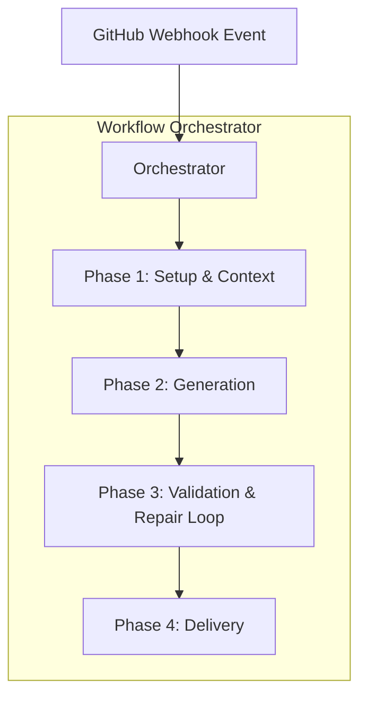
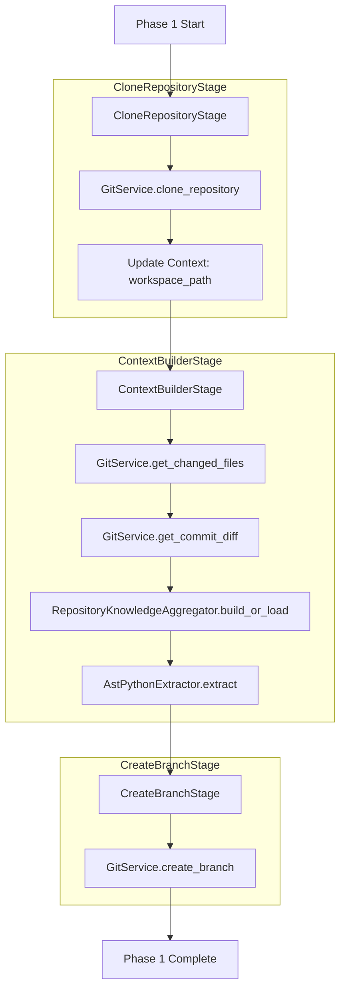
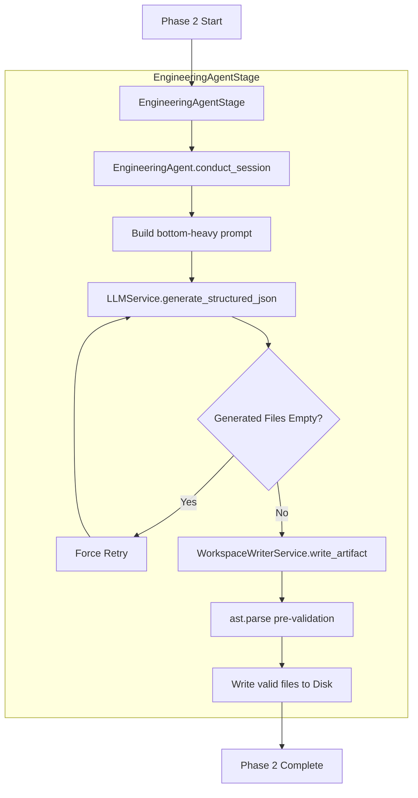
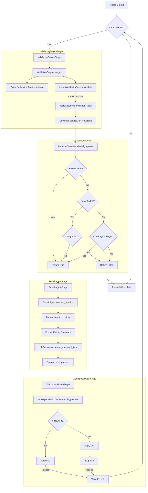
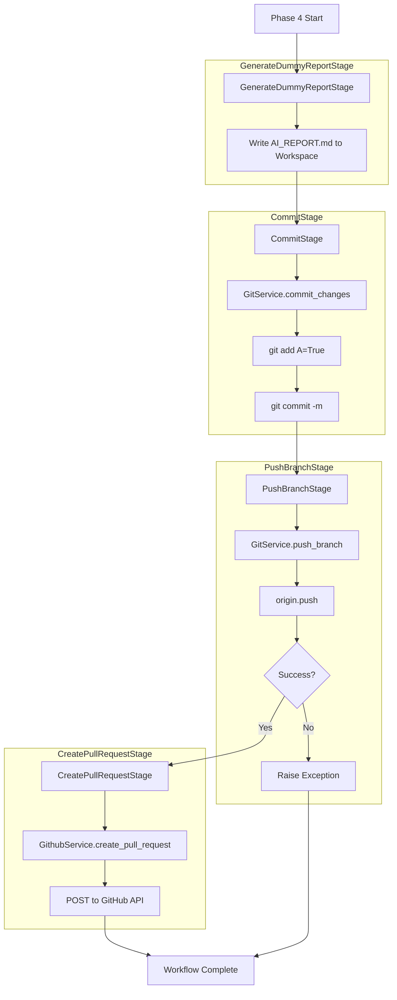

# DeliveryOS: End-to-End System Flow

This document outlines the current architecture of the DeliveryOS AI-SDE pipeline. The system operates as a state machine orchestrated by `WorkflowOrchestrator`, passing a shared `WorkflowContext` between distinct, single-responsibility `Stage` classes.

---

## High-Level Pipeline Orchestration

The pipeline is triggered via a GitHub Webhook (`POST /github/webhook`). The webhook launches a background task that executes the `WorkflowOrchestrator`.

---

## Phase 1: Setup & Context
**Goal:** Prepare the local workspace and gather all necessary code context before invoking the LLM.

---

## Phase 2: Test Generation
**Goal:** Analyze the git diff and generate an initial suite of tests focused entirely on the business logic that changed.

---

## Phase 3: Validation & Repair Loop
**Goal:** Ensure the generated tests are syntactically correct, importable, pass execution, and provide adequate coverage. If not, trigger the Repair Agent to patch the test files.

---

## Phase 4: Delivery
**Goal:** Generate a final report, commit the new tests, push to the remote, and open a Pull Request.

---

## Core Dependencies and Data Transfer

### 1. The `WorkflowContext` Object
All stages are completely stateless. The only state is passed around inside the `WorkflowContext` dataclass, which grows as the pipeline progresses:
- **Phase 1 adds:** `workspace`, `changed_files`, `structured_diff`, `llm_context`
- **Phase 2 adds:** `engineering_session`, `generated_tests`, `workspace_changes`
- **Phase 3 updates:** `validation_report`, `iteration_count`, `iteration_history`, `merge_confidence`
- **Phase 4 uses:** The finalized context to build the PR description.

### 2. The `LLMService` (The AI Engine)
Both `EngineeringAgent` and `RepairAgent` strictly rely on `LLMService.generate_structured_json()`.
- Model is hardcoded to `openai/gpt-4o-mini`.
- Native `json_object` response format is mandated.
- Output is automatically mapped to strictly typed Pydantic models (e.g., `EngineeringSessionSchema`, `RepairSessionSchema`).
- Caching is enabled for Engineering but explicitly bypassed (`skip_cache=True`) for Repair loops to prevent poisoning.
