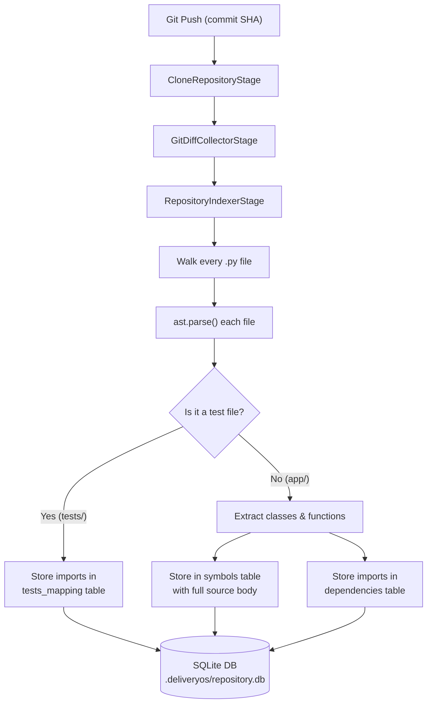
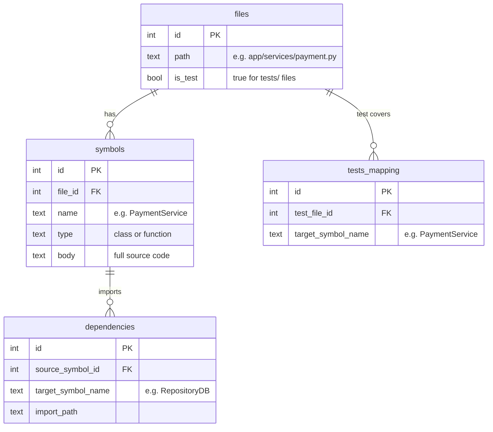
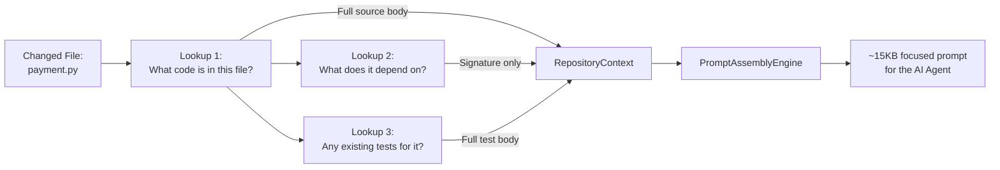
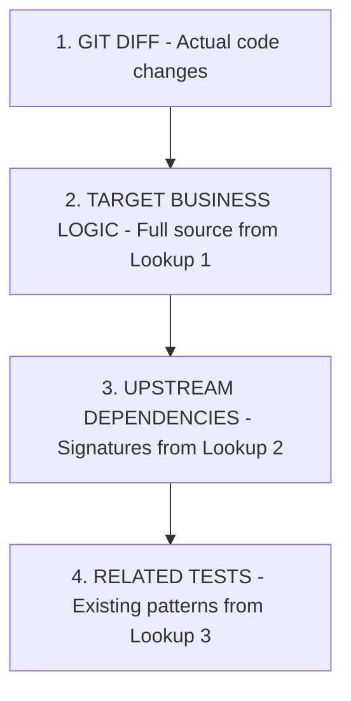
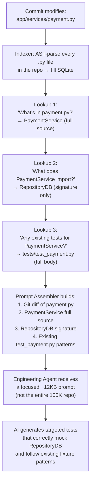

# Context Retrieval — How SQLite Powers the AI Agent

> The core idea: **Don't dump the whole repo into the prompt. Query for exactly what the AI needs.**

---

## The Problem

A typical commit touches 10–18 files. Naively sending the entire repository to the LLM results in:
- **Prompt overflow** — repos can be 100K+ lines.
- **Diluted attention** — the model tries to reason about unrelated code.
- **Hallucinated imports** — the model invents modules it "thinks" exist.

Our solution: build a **local SQLite index** of the entire repo's structure via AST parsing, then **query** it to retrieve only the symbols, dependencies, and test patterns relevant to the specific changed files.

---

## Phase 2 — Building the Index

### What the Indexer Does (Plain English)

The indexer walks through every `.py` file in the repo and reads its structure using Python's built-in AST (Abstract Syntax Tree) parser. Think of AST as a tool that reads a Python file and tells you: "This file has a class called `PaymentService` and a function called `process_refund`, and it imports `RepositoryDB`."

It stores all of this into a local SQLite database — essentially a **filing cabinet** with 4 labeled drawers.

---

## The Filing Cabinet (SQLite Database)

The database lives at `.deliveryos/repository.db` inside the cloned repo. It has 4 tables, each serving a specific purpose:

### Drawer 1: `files` — "What files exist in this repo?"

Every Python file gets a row. We also mark whether it's a test file or production code.

| id | path | is_test |
|----|------|---------|
| 1 | `app/services/payment.py` | No |
| 2 | `app/services/db.py` | No |
| 3 | `tests/test_payment.py` | Yes |

### Drawer 2: `symbols` — "What classes and functions are defined in each file?"

For every production file, we extract each class and function and store its **full source code**. This is the actual business logic the AI will need to read.

| id | file_id | name | type | body |
|----|---------|------|------|------|
| 1 | 1 | `PaymentService` | class | `class PaymentService:\n  def process(self)...` |
| 2 | 2 | `RepositoryDB` | class | `class RepositoryDB:\n  def connect(self)...` |

### Drawer 3: `dependencies` — "What does each symbol import from other files?"

For production files, we record what each class/function imports. This tells us what the AI will need to **mock** when writing tests.

| source_symbol_id | target_symbol_name |
|------------------|--------------------|
| 1 (PaymentService) | `RepositoryDB` |

Reading this row: *"PaymentService depends on RepositoryDB"*

### Drawer 4: `tests_mapping` — "Which test files test which symbols?"

For test files, we record what symbols they import. This lets us find existing tests that already cover a given class, so the AI can **reuse their patterns** instead of inventing new ones.

| test_file_id | target_symbol_name |
|--------------|--------------------|
| 3 (test_payment.py) | `PaymentService` |

Reading this row: *"test_payment.py tests PaymentService"*

---

## Phase 3 — Querying for Context (The 3 Lookups)

Now the filing cabinet is full. When a commit changes `app/services/payment.py`, the **ContextRetrievalEngine** opens the drawers and does 3 simple lookups:

### Lookup 1 — "Show me the full code of everything defined in the changed file"

Opens the `symbols` drawer and filters by the changed file path.

**Question:** *"What classes and functions are defined in `payment.py`?"*
**Answer:** `PaymentService` — here's its complete source code (50 lines).

This gives the AI the actual business logic it needs to understand in order to write tests.

### Lookup 2 — "What does this code depend on? (What should the AI mock?)"

Opens the `dependencies` drawer and follows the links.

**Question:** *"PaymentService imports something. What is it?"*
**Answer:** It imports `RepositoryDB`. Here's just the class signature (first line), not the full body — we only need enough for the AI to know what to mock.

This is critical: without this, the AI would either hallucinate what `RepositoryDB` looks like, or skip mocking it entirely.

### Lookup 3 — "Are there existing tests I can learn from?"

Opens the `tests_mapping` drawer and looks for any test file that already tests `PaymentService`.

**Question:** *"Does any existing test file already import PaymentService?"*
**Answer:** Yes — `tests/test_payment.py`. Here's its full content (the fixtures, mocking patterns, assertion style).

This is how the AI avoids inventing new testing patterns from scratch. It copies what already works in the project.

---

## Prompt Assembly — Combining Everything

The `PromptAssemblyEngine` takes the 3 lookup results and builds a single, tightly packed string (~15KB) with 4 sections:

| Section | What Goes In | Where It Comes From | Token Budget |
|---------|-------------|--------------------|--------------| 
| Git Diff | The actual `+` and `-` lines of what changed | `GitDiffCollectorStage` | Up to 5K chars per file |
| Target Business Logic | Full source code of changed classes/functions | Lookup 1 | Full body |
| Upstream Dependencies | Just the first line (signature) of imported symbols | Lookup 2 | Signature only |
| Related Tests & Fixtures | Full body of existing test files | Lookup 3 | Up to 3K chars per file |

### Why This Section Order Matters

LLMs have a **recency bias** — they pay more attention to text near the end of the prompt. So:
- **Git diff goes first** — always included even if context window is tight.
- **Related tests go last** — freshest in the model's memory when it starts generating code.
- **Critical rules and instructions** are appended at the very end by the Engineering Agent (after this prompt).

---

## End-to-End Example

### The Impact

| | Before (Naive) | After (SQLite Retrieval) |
|--|----------------|--------------------------|
| **Prompt size** | 80–150KB (entire repo) | 10–15KB (only relevant context) |
| **AI accuracy** | Low (hallucinated imports, wrong fixtures) | Higher (correct mocks, reuses patterns) |
| **Token cost** | High | ~85% reduction |
| **Speed** | Slow (huge prompts) | Fast (small, targeted prompts) |
