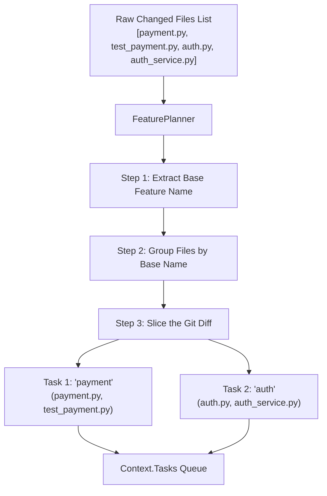
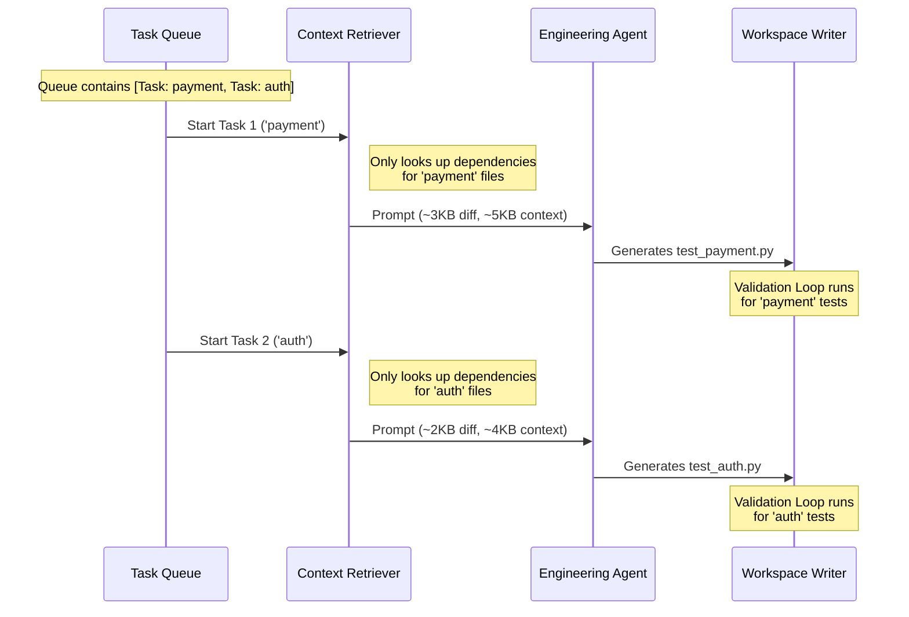

# Feature Planner & Task Queues

> How DeliveryOS handles huge git commits by breaking them down into manageable, independent AI tasks.

---

## The Problem

A developer pushes a massive PR that touches 25 files across 5 different features (e.g., `payment`, `auth`, `user_profile`, `email`, and `database_config`).

If we send this massive commit to the AI all at once:
1. **Context Window Blowout**: The `structured_diff` for 25 files will easily exceed the token limit.
2. **Cognitive Overload**: The LLM will try to write tests for `payment` while mixing in logic from `auth` and `email`. It will hallucinate connections that don't exist and write messy, monolithic test files.

## The Solution: Task Decomposition

Instead of one massive AI session, the **Feature Planner** intercepts the list of changed files, deterministically groups them by feature, and queues them up as independent **Engineering Tasks**.

The system then loops over this queue, processing one feature at a time.

---

## Phase 2.6 — The Feature Planner

The `FeaturePlanner` (located in `app/services/repository/planner.py`) runs deterministically without using an LLM.



### Step 1: Base Feature Name Extraction

The planner looks at the filename of every modified `.py` file and strips away common architectural suffixes and testing prefixes to find the core "business entity" name.

| Original Filename | Stripped Prefix/Suffix | Extracted Feature Name |
|-------------------|-------------------------|------------------------|
| `payment.py` | (none) | `payment` |
| `test_payment.py` | `test_` | `payment` |
| `payment_test.py` | `_test` | `payment` |
| `payment_service.py` | `_service` | `payment` |
| `payment_controller.py`| `_controller` | `payment` |
| `payment_repository.py`| `_repository` | `payment` |

By doing this, `payment_service.py` and `test_payment.py` are both resolved to the same feature bucket: `"payment"`.

### Step 2: Task Grouping & Diff Slicing

Once the files are grouped, the planner creates an `EngineeringTask` for each bucket. 

Crucially, it **slices the massive `structured_diff`** into smaller chunks. The `EngineeringTask` for "payment" will ONLY contain the git diffs for `payment.py` and `test_payment.py`. The diffs for `auth.py` are completely excluded.

---

## Phase 3 — The Task Queue Loop

Once the `FeaturePlanner` is done, the workflow orchestrator enters a loop.



### Why This is Powerful

1. **Perfect Isolation**: When the AI is generating tests for `auth`, it literally cannot see the code changes for `payment`. The prompt is hyper-focused.
2. **Parallelizable**: Currently, DeliveryOS processes the queue sequentially, but because tasks are fully independent, this queue can be distributed across parallel workers in the future.
3. **Resilience**: If the AI completely fails to generate valid tests for `auth` and hits the max 5 repair iterations, it aborts the `auth` task but **continues** to the `payment` task. One badly written feature doesn't tank the entire PR.

## Summary of Data Structures

The orchestrator relies on this simple dataclass (`app/workflows/context.py`) to manage the loop:

```python
class EngineeringTask(BaseModel):
    # e.g., 'payment'
    feature_name: str 
    
    # e.g., ['app/payment.py', 'tests/test_payment.py']
    related_files: List[str] 
    
    # The git diff, filtered down to ONLY the files above
    structured_diff: Dict[str, Any] 
```

By passing `EngineeringTask` objects into the Retrieval and AI stages instead of the raw git commit, DeliveryOS achieves highly deterministic, token-efficient, and accurate test generation, regardless of how large the incoming Pull Request is.
