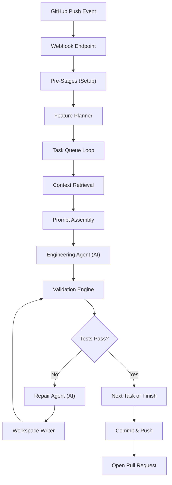

# DeliveryOS — System Flow Documentation

> How our AI Software Delivery Engineer works, from webhook trigger to Pull Request.

---

## Architecture Overview

---

## Phase 1 — Webhook Entry Point

**Purpose:** Receive GitHub push events and launch the pipeline as a background task.

| File | Class/Function | Method |
|------|---------------|--------|
| [main.py](file:///C:/Users/ksris/Documents/Software_Delivery/ai-delivery/app/main.py) | `app` (FastAPI) | Mounts `github_router` |
| [routes.py](file:///C:/Users/ksris/Documents/Software_Delivery/ai-delivery/app/github/routes.py) | `github_webhook()` | `POST /github/webhook` |
| [routes.py](file:///C:/Users/ksris/Documents/Software_Delivery/ai-delivery/app/github/routes.py#L28-L39) | `verify_signature()` | HMAC-SHA256 validation |

**Flow:**
1. GitHub sends an HTTP POST to `/github/webhook` via local tunnel.
2. `verify_signature()` checks the `x-hub-signature-256` header against our `WEBHOOK_SECRET`.
3. Payload is validated into `PushEventSchema`.
4. If the branch starts with `ai-sde/`, we ignore it (prevents infinite loops from our own commits).
5. Otherwise, `run_ai_sde_workflow(push_event)` is queued as a **background task**.

---

## Phase 2 — Pre-Stages (Repository Setup)

**Purpose:** Clone the repo, create an AI branch, collect the git diff, build the SQLite index, and decompose the commit into focused tasks.

These run sequentially via `WorkflowOrchestrator.run_pipeline()`:

### Stage 2.1 — Clone Repository
| File | Class | Method |
|------|-------|--------|
| [stages.py](file:///C:/Users/ksris/Documents/Software_Delivery/ai-delivery/app/workflows/stages.py#L24-L29) | `CloneRepositoryStage` | `execute()` |
| [git_service.py](file:///C:/Users/ksris/Documents/Software_Delivery/ai-delivery/app/services/git_service.py#L14-L41) | `GitService` | `clone_repository()` |

- Clones the repo into `workspace/{repo_name}`.
- If already cloned, does `git fetch` instead.
- Injects `GITHUB_TOKEN` into the HTTPS URL for authentication.

### Stage 2.2 — Create Branch
| File | Class | Method |
|------|-------|--------|
| [stages.py](file:///C:/Users/ksris/Documents/Software_Delivery/ai-delivery/app/workflows/stages.py#L40-L49) | `CreateBranchStage` | `execute()` |
| [git_service.py](file:///C:/Users/ksris/Documents/Software_Delivery/ai-delivery/app/services/git_service.py#L95-L107) | `GitService` | `create_branch()` |

- Checks out the exact commit SHA.
- Runs `git reset --hard` and `git clean -fd` to wipe leftover files from previous runs.
- Creates a new branch named `ai-sde/review-{sha[:7]}-{timestamp}`.

### Stage 2.3 — Analyze Files
| File | Class | Method |
|------|-------|--------|
| [stages.py](file:///C:/Users/ksris/Documents/Software_Delivery/ai-delivery/app/workflows/stages.py#L31-L38) | `AnalyzeFilesStage` | `execute()` |
| [git_service.py](file:///C:/Users/ksris/Documents/Software_Delivery/ai-delivery/app/services/git_service.py#L43-L58) | `GitService` | `get_changed_files()` |

- Diffs the commit against its parent to get a flat list of changed file paths.
- Stores result in `context.changed_files`.

### Stage 2.4 — Git Diff Collector
| File | Class | Method |
|------|-------|--------|
| [intelligence_stages.py](file:///C:/Users/ksris/Documents/Software_Delivery/ai-delivery/app/workflows/intelligence_stages.py#L11-L19) | `GitDiffCollectorStage` | `execute()` |
| [git_service.py](file:///C:/Users/ksris/Documents/Software_Delivery/ai-delivery/app/services/git_service.py#L60-L93) | `GitService` | `get_commit_diff()` |

- Collects **structured diffs** with actual code patches, categorized as `added`, `modified`, `deleted`, `renamed`.
- Stores result in `context.structured_diff`.

### Stage 2.5 — Repository Indexer
| File | Class | Method |
|------|-------|--------|
| [intelligence_stages.py](file:///C:/Users/ksris/Documents/Software_Delivery/ai-delivery/app/workflows/intelligence_stages.py#L21-L27) | `RepositoryIndexerStage` | `execute()` |
| [indexer.py](file:///C:/Users/ksris/Documents/Software_Delivery/ai-delivery/app/services/repository/indexer.py) | `RepositoryIndexer` | `index_repository()` |
| [db.py](file:///C:/Users/ksris/Documents/Software_Delivery/ai-delivery/app/services/repository/db.py) | `RepositoryDB` | SQLite schema |

- Walks every `.py` file in the workspace.
- Parses each file's AST to extract **classes**, **functions**, **imports**.
- Stores everything in a local SQLite database (`.deliveryos/repository.db`) with tables: `files`, `symbols`, `dependencies`, `tests_mapping`.
- Test files get their imports recorded in `tests_mapping` so we can later find "which tests cover which symbols."

### Stage 2.6 — Feature Planner
| File | Class | Method |
|------|-------|--------|
| [intelligence_stages.py](file:///C:/Users/ksris/Documents/Software_Delivery/ai-delivery/app/workflows/intelligence_stages.py#L29-L32) | `FeaturePlannerStage` | `execute()` |
| [planner.py](file:///C:/Users/ksris/Documents/Software_Delivery/ai-delivery/app/services/repository/planner.py) | `FeaturePlanner` | `create_tasks()` |

- Groups the flat list of changed files into **independent EngineeringTasks** by extracting a feature name from each file path (e.g., `payment_service.py` → `payment`, `test_payment.py` → `payment`).
- Each task gets its own isolated `structured_diff` containing only its relevant file diffs.
- Stores result in `context.tasks` (a list of `EngineeringTask` objects).

> **Why?** A single commit can touch 15+ unrelated files. Without decomposition, the LLM tries to reason about all of them at once and produces poor tests. Task decomposition ensures each AI call is focused on **one feature**.

---

## Phase 3 — Task Queue Loop (Per-Feature Engineering)

**Purpose:** For each `EngineeringTask`, retrieve targeted context, assemble a focused prompt, and call the AI to generate tests.

The loop iterates over `context.tasks`:

### Stage 3.1 — Context Retrieval
| File | Class | Method |
|------|-------|--------|
| [intelligence_stages.py](file:///C:/Users/ksris/Documents/Software_Delivery/ai-delivery/app/workflows/intelligence_stages.py#L34-L55) | `ContextRetrievalStage` | `execute()` |
| [retriever.py](file:///C:/Users/ksris/Documents/Software_Delivery/ai-delivery/app/services/repository/retriever.py) | `ContextRetrievalEngine` | `retrieve()` |

- Queries the SQLite index for:
  1. **Target Symbols** — classes/functions defined in the changed files (full source body).
  2. **Dependencies** — upstream symbols imported by the targets (signature only, to save tokens).
  3. **Related Tests** — existing test files that import any of the target symbols (full body, for pattern reuse).
- Returns a `RepositoryContext` object.

### Stage 3.2 — Prompt Assembly
| File | Class | Method |
|------|-------|--------|
| [intelligence_stages.py](file:///C:/Users/ksris/Documents/Software_Delivery/ai-delivery/app/workflows/intelligence_stages.py#L57-L68) | `PromptAssemblyStage` | `execute()` |
| [prompter.py](file:///C:/Users/ksris/Documents/Software_Delivery/ai-delivery/app/services/repository/prompter.py) | `PromptAssemblyEngine` | `assemble_prompt()` |

- Builds a single focused string (~10-15KB) structured as:
  1. `=== GIT DIFF ===` — the actual code changes for this task.
  2. `=== TARGET BUSINESS LOGIC ===` — full source of changed symbols.
  3. `=== UPSTREAM DEPENDENCIES ===` — signatures of things to mock.
  4. `=== RELATED TESTS & FIXTURES ===` — existing test patterns to follow.
- Stores in `context.llm_context`.

### Stage 3.3 — Engineering Agent (AI Call)
| File | Class | Method |
|------|-------|--------|
| [engineering_stage.py](file:///C:/Users/ksris/Documents/Software_Delivery/ai-delivery/app/workflows/engineering_stage.py) | `EngineeringAgentStage` | `execute()` |
| [agent.py](file:///C:/Users/ksris/Documents/Software_Delivery/ai-delivery/app/agents/engineering/agent.py) | `EngineeringAgent` | `conduct_session()` |
| [llm_service.py](file:///C:/Users/ksris/Documents/Software_Delivery/ai-delivery/app/services/llm_service.py) | `LLMService` | `generate_structured_json()` |

- Builds a final prompt with sections: Task Metadata → Changed Files → Repository Context → Critical Rules (placed at the end for LLM recency bias).
- Calls `openai/gpt-4o-mini` via OpenRouter with `response_format: json_object`.
- The LLM returns an `EngineeringSessionSchema` containing:
  - `change_summary` — risk analysis, affected modules, breaking changes.
  - `test_plan` — scenarios, recommended test levels, coverage strategy.
  - `generated_tests` — complete Python test files ready to write to disk.
- Has 3 retry attempts. If the model returns an empty `generated_files` list, it force-retries.
- `WorkspaceWriterService.write_artifact()` writes the generated test files to `workspace/tests/`.

---

## Phase 4 — Validation & Repair Loop

**Purpose:** Deterministically validate the AI-generated tests, and if they fail, feed errors back to the AI for repair. Repeats up to 5 iterations.

### Stage 4.1 — Validation Engine
| File | Class | Method |
|------|-------|--------|
| [quality_stages.py](file:///C:/Users/ksris/Documents/Software_Delivery/ai-delivery/app/workflows/quality_stages.py#L13-L26) | `ValidationEngineStage` | `execute()` |
| [validators.py](file:///C:/Users/ksris/Documents/Software_Delivery/ai-delivery/app/services/validators.py) | `ValidationEngine` | `run_all()` |

Runs 4 deterministic checks in order:

| Check | Service | What It Does |
|-------|---------|-------------|
| Syntax | `SyntaxValidationService` | `ast.parse()` on every `.py` file |
| Imports | `ImportValidationService` | `pytest --collect-only` to detect import failures |
| Test Execution | `TestExecutionService` | Runs `pytest` and captures pass/fail/error counts |
| Coverage | `CoverageService` | Runs `pytest --cov` and captures coverage % |

- If syntax or imports fail, `build_status = False` and test execution is skipped.
- Result is stored in `context.validation_report`.

### Stage 4.2 — Iteration Controller (Decision Gate)
| File | Class | Method |
|------|-------|--------|
| [iteration.py](file:///C:/Users/ksris/Documents/Software_Delivery/ai-delivery/app/workflows/iteration.py) | `IterationController` | `should_improve()` |

Decides whether to trigger another repair iteration:
- **Max iterations** (5) reached → Stop.
- **Build broken** (syntax/import error) → Must repair.
- **Tests failing** → Repair, but with **stagnation detection**: if `tests_passed` doesn't improve for 2 consecutive iterations, abort.
- **Coverage below 90%** → Continue improving.
- **Everything passing** → Stop.

### Stage 4.3 — Repair Agent (AI Call)
| File | Class | Method |
|------|-------|--------|
| [repair_stage.py](file:///C:/Users/ksris/Documents/Software_Delivery/ai-delivery/app/workflows/repair_stage.py) | `RepairAgentStage` | `execute()` |
| [agent.py](file:///C:/Users/ksris/Documents/Software_Delivery/ai-delivery/app/agents/repair/agent.py) | `RepairAgent` | `conduct_session()` |

- Builds a prompt containing:
  1. **Structured Failure Summary** — pre-processed from the validation report (not raw JSON). Extracts only `FAILURES` and `ERRORS` sections from pytest output.
  2. **Previous Repair Attempts** — so the LLM knows what was already tried and failed.
  3. **Current Test Source Code** — the files that need fixing.
  4. **Original Production Source** — for reference.
  5. **Critical Rules** — "Only repair test files. Regenerate the ENTIRE file. No placeholders."
- **Hard Filter**: Any file the LLM outputs that doesn't start with `tests/` or `test/` is **dropped**.
- Returns `RepairedArtifact` containing complete file contents.

### Stage 4.4 — Workspace Writer (File Overwrite)
| File | Class | Method |
|------|-------|--------|
| [quality_stages.py](file:///C:/Users/ksris/Documents/Software_Delivery/ai-delivery/app/workflows/quality_stages.py#L87-L101) | `WorkspaceWriterStage` | `execute()` |
| [workspace_writer.py](file:///C:/Users/ksris/Documents/Software_Delivery/ai-delivery/app/services/workspace_writer.py) | `WorkspaceWriterService` | `write_repaired_files()` |

Before overwriting any file, applies 4 validation gates:

| Gate | Check | Rejection Reason |
|------|-------|-----------------|
| 1 | Content not empty | Prevents writing blank files |
| 2 | Path ends with `.py` | Only Python supported |
| 3 | Size reduction < 50% | Catches accidental deletion (LLM hallucination) |
| 4 | AST parse + `DuplicateDefinitionVisitor` | Catches duplicate class/function names |

Only if all 4 pass does the file get overwritten on disk. Then the loop returns to **Stage 4.1** for re-validation.

---

## Phase 5 — Merge Confidence & PR Creation

**Purpose:** Score the final quality and push everything to GitHub.

### Stage 5.1 — Merge Confidence Calculation
| File | Class | Method |
|------|-------|--------|
| [iteration.py](file:///C:/Users/ksris/Documents/Software_Delivery/ai-delivery/app/workflows/iteration.py#L49-L74) | `IterationController` | `calculate_merge_confidence()` |

Calculates a 0–100 score:
- **30 points** — Build passes (syntax + imports clean).
- **50 points** — Test pass rate (proportional).
- **20 points** — Code coverage percentage.

### Stage 5.2 — Generate AI Report
| File | Class | Method |
|------|-------|--------|
| [stages.py](file:///C:/Users/ksris/Documents/Software_Delivery/ai-delivery/app/workflows/stages.py#L51-L163) | `GenerateDummyReportStage` | `execute()` |

- Writes `AI_REPORT.md` to the workspace root containing:
  - Executive summary, risk level, architecture impact.
  - Test plan scenarios.
  - Generated test file list, frameworks, fixtures, mocks.
  - Validation results (syntax, imports, test pass rate, coverage).
  - Merge confidence score.

### Stage 5.3 — Commit, Push & PR
| File | Class | Method |
|------|-------|--------|
| [stages.py](file:///C:/Users/ksris/Documents/Software_Delivery/ai-delivery/app/workflows/stages.py#L165-L197) | `CommitStage` / `PushBranchStage` / `CreatePullRequestStage` | `execute()` |
| [git_service.py](file:///C:/Users/ksris/Documents/Software_Delivery/ai-delivery/app/services/git_service.py#L109-L130) | `GitService` | `commit_changes()` / `push_branch()` |
| [github_service.py](file:///C:/Users/ksris/Documents/Software_Delivery/ai-delivery/app/services/github_service.py) | `GitHubService` | `open_pull_request()` |

1. `git add -A` + `git commit` with message "Add AI_REPORT for {sha}".
2. `git push origin {ai_branch}`.
3. Opens a Pull Request from `ai-sde/review-{sha}-{ts}` → `main` via the GitHub API.

---

## Key Services

| Service | File | Purpose |
|---------|------|---------|
| `LLMService` | [llm_service.py](file:///C:/Users/ksris/Documents/Software_Delivery/ai-delivery/app/services/llm_service.py) | All AI calls via OpenRouter. Fixed model: `openai/gpt-4o-mini`. Includes prompt-hash-based LLM response caching. |
| `GitService` | [git_service.py](file:///C:/Users/ksris/Documents/Software_Delivery/ai-delivery/app/services/git_service.py) | Clone, diff, branch, commit, push via `GitPython`. |
| `GitHubService` | [github_service.py](file:///C:/Users/ksris/Documents/Software_Delivery/ai-delivery/app/services/github_service.py) | PR creation via `PyGithub`. |
| `WorkspaceWriterService` | [workspace_writer.py](file:///C:/Users/ksris/Documents/Software_Delivery/ai-delivery/app/services/workspace_writer.py) | Writes files to disk with AST/size/duplicate validation gates. |
| `RepositoryDB` | [db.py](file:///C:/Users/ksris/Documents/Software_Delivery/ai-delivery/app/services/repository/db.py) | SQLite database for the repository index. |
| `WorkflowOrchestrator` | [orchestrator.py](file:///C:/Users/ksris/Documents/Software_Delivery/ai-delivery/app/workflows/orchestrator.py) | Runs stages sequentially, tracks timing and errors. Stops on first failure. |

---

## Shared State

All stages read from and write to a single `WorkflowContext` object ([context.py](file:///C:/Users/ksris/Documents/Software_Delivery/ai-delivery/app/workflows/context.py)). Key fields:

| Field | Set By | Used By |
|-------|--------|---------|
| `workspace` | CloneRepositoryStage | Everything |
| `changed_files` | AnalyzeFilesStage | FeaturePlanner, RepairAgent |
| `structured_diff` | GitDiffCollectorStage | FeaturePlanner |
| `tasks` | FeaturePlannerStage | Task Loop |
| `current_task` | Task Loop | ContextRetrieval, PromptAssembly, EngineeringAgent |
| `llm_context` | PromptAssemblyStage | EngineeringAgent |
| `generated_tests` | EngineeringAgentStage | ValidationEngine, RepairAgent |
| `validation_report` | ValidationEngineStage | IterationController, RepairAgent |
| `repaired_artifact` | RepairAgentStage | WorkspaceWriterStage |
| `iteration_history` | RepairAgentStage | RepairAgent (to avoid repeating failed approaches) |
| `merge_confidence` | IterationController | AI Report |
