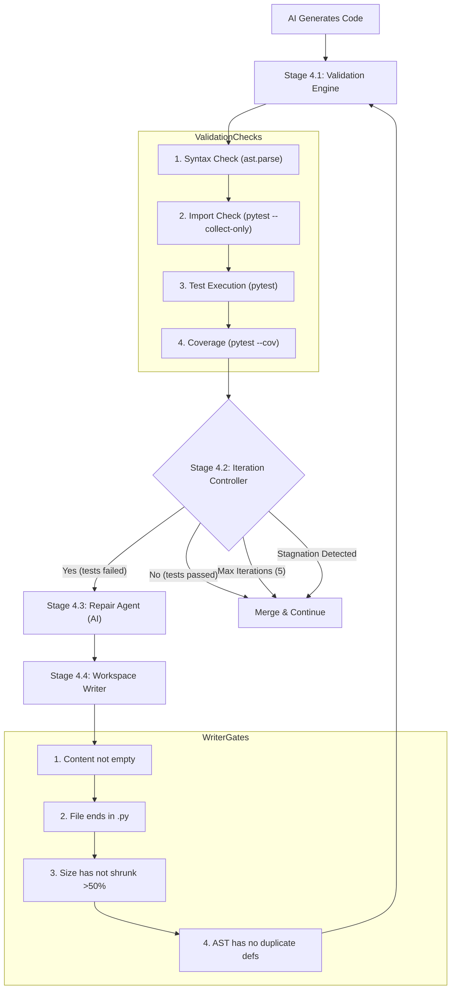

# Validation & Repair Loop

> How DeliveryOS automatically catches bad AI code, feeds the exact errors back to the model, and iterates until the tests pass.

---

## The Problem

LLMs are not perfect. When generating tests, they often:
- Make syntax errors (missing colons, bad indentation).
- Import modules that don't exist.
- Write tests that fail because they misunderstood the business logic.
- Hallucinate mock setups that cause exceptions.

If we just merged the first thing the AI wrote, the codebase would quickly break. We need a deterministic, compiler-driven way to catch these errors and force the AI to fix them.

## The Solution: Phase 4

DeliveryOS wraps the AI in a rigid, deterministic feedback loop. After the AI generates code, the system actually tries to compile and run it. If it fails, the exact terminal output is parsed and sent back to the AI for a rewrite. This process repeats up to **5 times**.

---

## The Loop Architecture

---

## Step-by-Step Breakdown

### Stage 4.1 — Validation Engine

The engine runs a gauntlet of 4 deterministic checks on the workspace. If an early check fails, the later ones are skipped to save time.

1. **Syntax Check**: Uses Python's built-in `ast.parse` on every `.py` file. If the AI hallucinated invalid Python, this catches it immediately.
2. **Import Check**: Runs `pytest --collect-only`. This verifies that all modules can be imported without throwing `ModuleNotFoundError` or `ImportError`.
3. **Test Execution**: Runs `pytest`. Captures the exact number of passes, failures, and errors.
4. **Coverage Check**: Runs `pytest --cov`. Ensures the generated tests actually exercise the business logic.

*Output: A structured `ValidationReport`.*

### Stage 4.2 — Iteration Controller (The Decision Gate)

This component looks at the `ValidationReport` and decides whether to trigger another AI repair cycle.

**Rules for Repair:**
- **Max limit:** If we've hit 5 iterations, stop (prevents infinite loops).
- **Build broken:** If syntax or imports failed, ALWAYS repair.
- **Tests failing:** If tests failed, repair.
- **Stagnation Detection:** If tests are failing, but the number of passing tests hasn't improved for 2 consecutive iterations, ABORT early. (This stops the AI from wasting API credits when it's stuck in a loop trying the same broken fix over and over).
- **Coverage low:** If coverage is below 90%, continue improving.

### Stage 4.3 — Repair Agent (AI)

If repair is needed, we call the LLM again. But we don't just say "it failed." We give it a highly structured prompt:

1. **Structured Failure Summary**: We parse the raw pytest output and extract *only* the `FAILURES` and `ERRORS` sections. (Sending the entire raw pytest log would blow out the token limit).
2. **Previous Attempts**: We feed the AI a history of what it tried in iterations 1, 2, and 3, so it doesn't try the exact same fix again.
3. **Current Source Code**: The exact contents of the test file that is failing.
4. **Production Code**: The original business logic for reference.

**Crucial Rule:** The Repair Agent is instructed to rewrite the **ENTIRE test file** from scratch. It is not allowed to use placeholders or partial patches.

### Stage 4.4 — Workspace Writer

The LLM returns a new, rewritten test file. Before DeliveryOS writes this to the physical hard drive, it passes it through 4 safety gates to prevent catastrophic AI hallucinations:

| Gate | What it Checks | Why it Exists |
|------|---------------|---------------|
| 1 | Content not empty | Sometimes the LLM crashes and returns `""`. We drop this. |
| 2 | Ends with `.py` | Prevents the AI from accidentally creating `.txt` or `.md` files. |
| 3 | Size > 50% of old file | If the old test file was 200 lines and the AI returns 10 lines, it probably hallucinated a placeholder like `// ... rest of code`. We reject this. |
| 4 | AST / Duplicate Defs | The AI sometimes appends a new version of a test function while leaving the old broken one in the file. `DuplicateDefinitionVisitor` parses the AST and rejects the file if two functions have the exact same name. |

If all 4 gates pass, the file is overwritten on disk. The loop then goes all the way back up to **Stage 4.1**, where `pytest` is run against the newly written code.

---

## Why Full File Overwrites? (The Patching Problem)

Earlier versions of DeliveryOS tried to have the AI output "Search and Replace" patches (e.g., "Find lines 10-15 and replace them"). 

**The Result:** The LLM was terrible at counting lines. It constantly missed the target block, resulting in duplicate functions, mangled syntax, and double-imports. 

**The Fix:** By forcing the AI to output the *complete, absolute file contents*, and pairing that with the AST Duplicate Validator (Gate 4), DeliveryOS eliminated patching bugs entirely. The system now either writes a structurally sound file, or rejects it before it hits the disk.
